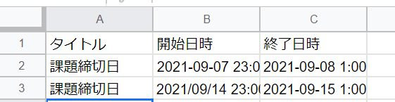
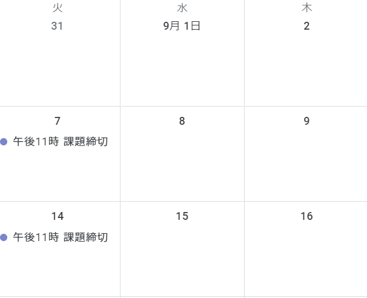
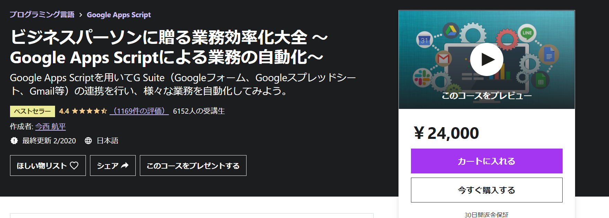

どうもカニヤです。

今大学は**オンライン授業**なので**通常より課題の量が増えました。**

そして、課題の締切日が**課題ごとに違うため**、提出日が**分からなくなり**
課題を出し**忘れそうになること**がたまにありました。

（もちろん**出し忘れたことは一度**もありません！）

その悩みを解決するため今回**前々から学習していた GAS を使い、**
あらかじめ**課題の締切日を全てスプレッドシートに書き。**

それらを<span className="line line-yellow">自動で Google カレンダーに登録するプログラムを作成すること</span>にしました。

**同じような悩みを抱えている方**も一緒にその悩みを解決しましょう！

### GAS とは

---

<br />

はじめに**GAS**について説明します。

<blockquote display="info">

**Google Apps Script（GAS）**は Google が提供している**JavaScript ベースのプログラミング言語。**

GAS は**Gmail・スプレッドシートなど様々な Google サービスと連携すること**ができます。

</blockquote>

その中で**今回は Google スプレッドシートと Google カレンダー**と連携します。

### GAS の始め方

---

<br />

GAS を**始めるまでの手順**を説明する。

<font color="blue">スプレッドシートを使う場合の始め方</font>

<blockquote display="default">

1. 最初に GoogleDrive にログイン
2. 新規を押して、Google スプレッドシートを開く
3. スプレッドシートのツールからスクリプトエディタを押す

</blockquote>

これで **GAS**を使えるようになりました。

今回は**Google スプレッドシートを使うので、この方法で始める。**

GAS を**いきなり始める方法**もあります。

<font color="blue">通常の始め方</font>

<blockquote display="default">

1. 最初に GoogleDrive にログイン
2. 新規を押して、その他から GAS を選ぶ
   （ない場合はアプリを追加からインストールする）

</blockquote>

これで完了です。

### 自動登録プログラミングを組む

---

<br />

下準備として、**スプレッドシートに自分が追加したい予定**を書きます。
（私の場合は**課題の締切日**）

予定を登録するには<span className="line line-yellow">タイトル・開始日時・終了日時が必要</span>なのでこんな感じに書く。



そしたら、GAS に戻ります。

```js
const calendar = CalendarApp.getCalendarById('自分のカレンダーID')
const sheet = SpreadsheetApp.getActiveSpreadsheet().getSheetByName('シート名')
```

まず、**function**の上に**自分のカレンダー ID を渡して calendar**を定義。

<font color="blue">カレンダー ID の場所</font>

<blockquote display="default">

Google カレンダーを開く → 設定
→ マイカレンダーの設定で登録したいカレンダーを選択<br/>
→ カレンダーの統合 → カレンダー ID

</blockquote>

**スプレッドシートからデータを取得する**ために**シート名を渡し sheet**を定義。

```js
function calendarRegister() {
  const datas = sheet.getDataRange().getValues()
  datas.shift()

  for (data of datas) {
    calendar.createEvent(
      data[0], // タイトルが入っている
      data[1], //　開始日時が入っている
      data[2] //　終了日時が入っている
    )
  }
}
```

**getDataRange**を指定しない場合は**A1 から取得**してくる。<br/>
また、**getValues**ですべてのデータを取得する。

**datas**には**行ごとに配列として**入っています。

そのため、このままだと**最初にタイトル・日時も入ってしまう**ので、
**datas.shift()**で最初の配列の要素を取り除く。

次に**行ごとのデータを取り出すため**に for 文で datas を回す。

そして**createEvent にタイトル・開始日時・終了日時**を渡して完了。

後はプログラミングを動かして、**Google アカウントの認証**を求められるので、**自分のアカウントを選択。**

そうすると<span className="line line-yellow">このアプリは Google で確認されていません</span>と**出る場合**があります。

その場合は**詳細 → プロジェクト名ページに戻る**を押す。
その後、**アクセス許可**を求められるので**許可ボタンを押せば OK.**

そしたらプログラミングが動き**カレンダーに予定が自動で登録**されます。



### まとめ

---

<br />

今回**自動で Google カレンダーに予定を登録するプログラムを作成しました。**

たったこれだけのコードで**簡単に自動登録すること**ができるので、<br/>
**予定が沢山ある方**や**約束を良く忘れる方**はぜひこの方法を試してみてください。

そうすれば<span className="line line-yellow">予定を忘れること</span>はもうありません。

**GAS**を使えば**他にも様々なことを自動化すること**ができるので、
これから**色々なことを試していきたい**と思います。

ちなみに**GAS の Udemy オススメ講座**はこちら ↓



<div className="ude ude-link">
  <a
    href="https://px.a8.net/svt/ejp?a8mat=3HIGXH+87WGFM+3L4M+BW8O2&a8ejpredirect=https%3A%2F%2Fwww.udemy.com%2Fcourse%2Fgas_for_operational_efficiency%2F"
    rel="nofollow"
  >
    Udemy公式サイトで見る
  </a>
  
</div>
<br />
<br />

---
