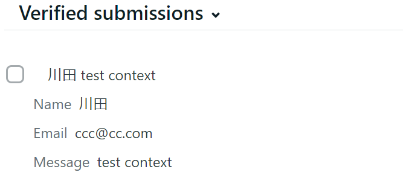

import { Link } from 'gatsby'

どうもカニヤです。

**お問い合わせフォームを作った**のですが、<br/>
記事を書いていなかったので、今回書きたいと思います。

ブログを**Netlify でホスティングしている**ので、<br/>
**お問い合わせフォームは Netlify を使って作成**しました。

**受信など**にはバックエンドのプログラムが**必要**。

しかし、Netlify を使えば**バックエンドのコードを書くことなく無料**で作成できる。

さっそく**Netlify を使っての作成方法**を解説します。

### 1. お問い合わせページの作成

---

<br />

名前は何でもいいですが、ここでは**contact.js と言う名前**でまず作成します。

```jsx
import React from 'react'
import Layout from '../components/Layout'

const Contact = () => {
  return (
    <Layout>
      <section className="contact-page">
        <div className="page-center">
          <h2>お問い合わせ</h2>

          <form
            className="contact-form"
            name="contact"
            method="post"
            netlify-honeypot="bot-field"
            data-netlify="true"
            action="/success"
          ></form>
        </div>
      </section>
    </Layout>
  )
}

export default Contact
```

```css
.contact-page {
  display: grid;
  place-items: center;
  text-align: center;
}

.page-center {
  width: 90vw;
  margin: 0 auto;
  max-width: 1170px;
}
@media screen and (min-width: 992px) {
  .page-center {
    width: 95vw;
  }
}
.contact-form {
  display: flex;
  flex-wrap: wrap;
  justify-content: center;
  align-items: center;
  flex-direction: column;
}
```

section タグで**ページ全体**を囲み、div タグで**フォーム**を囲みます。

そして、<span className="line line-yellow">この form タグの設定が一番重要です！</span>

まず**name,method,data-netlify,action の設定**は必ずしてください！

**data-netlify を true にすること**で form タグ内の入力は**Netlify に送られる。**

**action**は送信ボタンが押された後の**遷移するページの設定**になります。

また、**netlify-honeypot="bot-field"で bot を感知するようになる**ので設定することを勧めます。

```jsx
<form
  className="contact-form"
  name="contact"
  method="post"
  netlify-honeypot="bot-field"
  data-netlify="true"
  action="/success"
>
  <input
    type="text"
    name="name"
    placeholder="お名前"
    className="form-input"
    required
  />
  <input
    type="email"
    name="email"
    className="form-input"
    placeholder="メールアドレス"
    required
  />
  <textarea
    name="message"
    className="form-textarea"
    placeholder="こちらにお問い合わせ内容を入力してください"
    required
  />
  <button type="submit" className="form-input submit-btn">
    送信
  </button>
</form>
```

```css
.form-input,
.form-textarea {
  padding: 0.5rem;
  border: 0.5px solid hsl(212, 33%, 89%);
  border-right: transparent;
  font-size: 1rem;
  margin: 0.5rem 0;
  border-radius: 0.25rem;
  display: block;
  width: 20rem;
}
.form-textarea {
  height: 15rem;
}
.submit-btn {
  background: #000;
  color: white;
  font-weight: 400;
  cursor: pointer;
  box-shadow: 0 1px 3px rgb(0 0 0 / 20%);
}
.submit-btn:hover {
  color: black;
  background: rgb(138, 137, 137);
}
```

あとは**名前・メール・内容のフォーム、送信ボタンを作り**お問い合わせページは完成です。

**required は付けなくても大丈夫**ですが、空の送信をされても困るので設定しました。

### 2. 送信完了ページの作成

---

<br />

次に**送信が完了した後の遷移するページ**を作成します。(ここでは**success.js**と言う名前)

```jsx
import React from 'react'
import Layout from '../components/Layout'
import { Link } from 'gatsby'
const Success = () => {
  return (
    <Layout>
      <section className="contact-page">
        <div className="page-center">
          <h2>送信完了！</h2>
          <Link to="/" className="btn">
            戻る
          </Link>
        </div>
      </section>
    </Layout>
  )
}

export default Success
```

このページは**送信完了を伝えるページ**なので、<br/>
**「送信完了」の文字とホーム画面に戻るボタン**だけの**シンプルなもの**にします。

css はお問い合わせページのものを流用。

**これで全て完了です。**

### 3. テスト送信

---

<br />

**実行環境**でさっそくお問い合わせフォームを入力しましょう。

**テスト送信**なので、メールアドレスも**デタラメに入力して大丈夫です。**

送信ボタンを押して、**画面が遷移したら**ひとまず OK。

次に**Netlify→ 自分のサイト →Forms**を押して、下の**contact をクリックすると先ほど送ったもの**があると思います。

詳細を見るとこんな感じ ↓


**このように表示されていたら成功。**

### まとめ

---

<br />

今回**Netlify を使ってのお問い合わせフォーム作成方法**を解説しました。

Netlify を使うと**こんな簡単にお問い合わせフォームを作成**できます。

**お問い合わせフォームはブログには欠かせないもの**だと思うので、<br/>
まだ**作成してない方**はこれを機にぜひ作ってみましょう！

**Gatsby ブログの機能を追加する記事**を他にも書いているので、
興味がある方は**他の記事**も読んでもらえると嬉しいです。

<Link to="/category/Gatsby" className="btn center-btn">
  関連記事
</Link>

---
