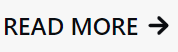
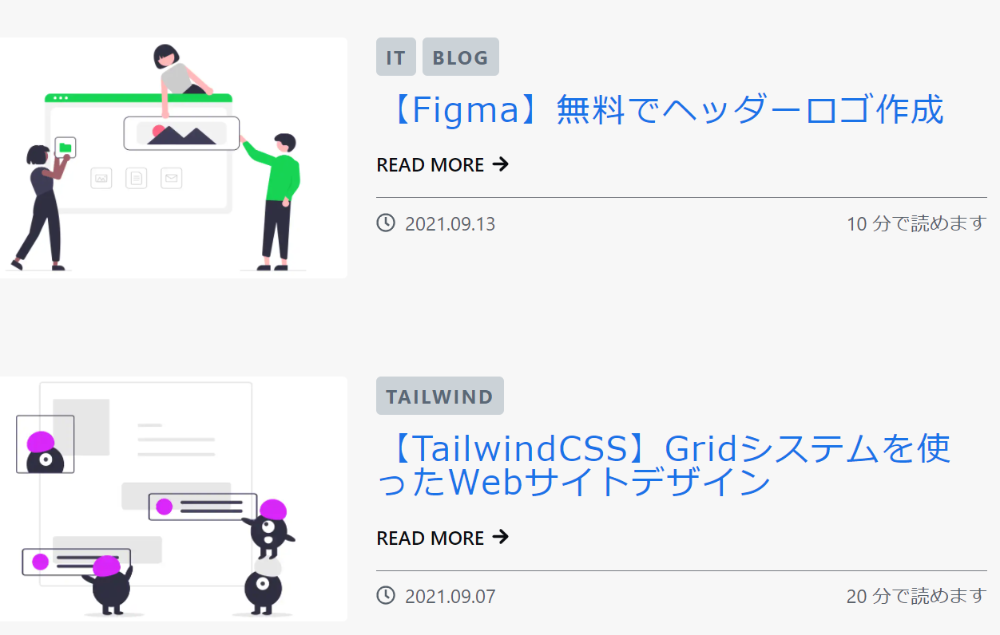
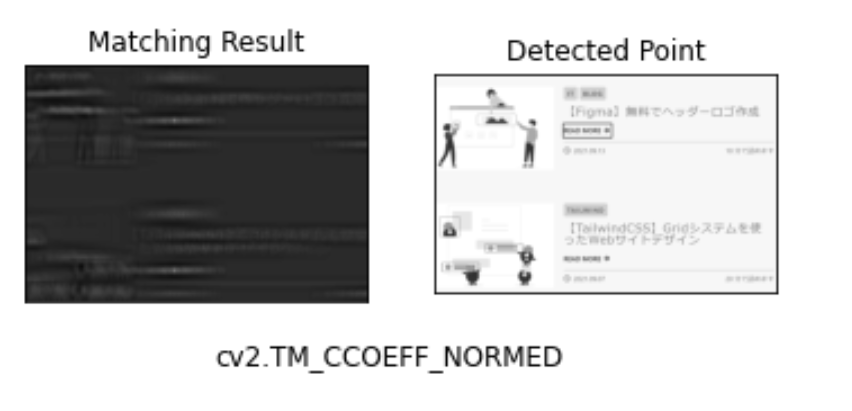
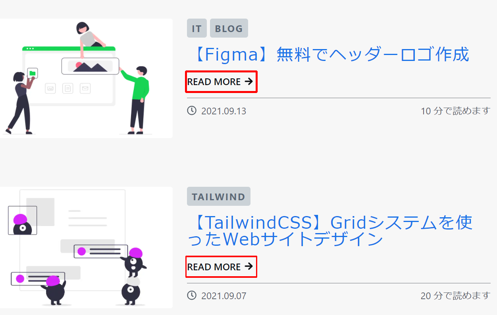

import { Link } from 'gatsby'

どうもカニヤです。

最近**OpenCV**を勉強していて、**物体検出（テンプレートマッチング）**と言うモノを知り<br/>
面白そうだと思ったので、**やってみること**にしました。

実際にやってみて**思ったより簡単**に実装できたので、<br/>
**その過程**を今回紹介したいと思います。

### はじめに

---

<br />

**1 から全部実装する**のはさすがに大変なので、<br/>
今回は**物体検出のチュートリアル**に沿ってやります。

使うサイト：**テンプレートマッチング-OpenCV-python tutorials**

「opencv テンプレートマッチング」と検索すれば出てくると思います。

また、**Google Colaboratory**を使ってコードを書いていきます。

私は**テンプレート画像**にこれを使い、



**検出したい画像**にこれを使います。



### 単体のテンプレートマッチング

---

<br />

それではさっそくコードを書いていきます。

まず**必要なもの**をインポート。

```python
import cv2
import numpy as np
from matplotlib import pyplot as plt
%matplotlib inline

```

次に**画像とメソッド**を変数に入れます。

```python
img = cv2.imread('検出したい画像のパス',0)
img2 = img.copy()
template = cv2.imread('テンプレート画像のパス',0)
w, h = template.shape[::-1]

methods = ['cv2.TM_CCOEFF', 'cv2.TM_CCOEFF_NORMED', 'cv2.TM_CCORR',
            'cv2.TM_CCORR_NORMED', 'cv2.TM_SQDIFF', 'cv2.TM_SQDIFF_NORMED']

```

そして、**画像を出力**します。

```python
for meth in methods:
    img = img2.copy()
    method = eval(meth)

    res = cv2.matchTemplate(img,template,method)
    min_val, max_val, min_loc, max_loc = cv2.minMaxLoc(res)

    # ここで画像の位置に枠を付ける
    if method in [cv2.TM_SQDIFF, cv2.TM_SQDIFF_NORMED]:
        top_left = min_loc
    else:
        top_left = max_loc
    bottom_right = (top_left[0] + w, top_left[1] + h)

    cv2.rectangle(img,top_left, bottom_right, 0, 2)# チュートリアルだとここが255

    plt.subplot(121),plt.imshow(res,cmap = 'gray')
    plt.title('Matching Result'), plt.xticks([]), plt.yticks([])
    plt.subplot(122),plt.imshow(img,cmap = 'gray')
    plt.title('Detected Point'), plt.xticks([]), plt.yticks([])
    plt.suptitle(meth)

    plt.show()
```

チュートリアルだと**枠の色が 255**なのですが、<br/>
これだと出力すると**見ずらいため０**にしました。

出力結果 ↓


これでも**グレースケール**なので見ずらいですが、<br/>
チュートリアルのままよりは**ましなレベル**です。

しかし、**見ての通り**これだと**上の READ MORE だけ**を検出して、<br/>
**下の方**は検出されていません。

なので、次に**複数検出する方法**を紹介します。

### 複数のテンプレートマッチング

---

<br />

今度は画像をカラーで変数に入れます。

```python
img_rgb = cv2.imread('検出したい画像のパス')
img_gray = cv2.cvtColor(img_rgb, cv2.COLOR_BGR2GRAY)
template = cv2.imread('テンプレート画像のパス',0)
w, h = template.shape[::-1]
```

画像を出力。

```python
res = cv2.matchTemplate(img_gray,template,cv2.TM_CCOEFF_NORMED)
threshold = 0.8
loc = np.where( res >= threshold)
# ここで複数検出している
for pt in zip(*loc[::-1]):
    cv2.rectangle(img_rgb, pt, (pt[0] + w, pt[1] + h), (0,0,255), 2)

cv2.imwrite('res.png',img_rgb)
```

**res.png**として画像が出力されるので、見てみると**こんな感じ**です。



### まとめ

---

<br />

今回**単体と複数のテンプレートマッチングをしてみた過程**を紹介しました。

**画像の物体検出**に関しては思ったより**簡単に実装できた**ので、<br/>
次は**動画の物体検出**をしてみたいと思います。

<span className="line line-yellow">
  \OpenCVを学びたい人はこの Udemy 講座がおすすめ/
</span>
<br />
<br />


<br />

<div className="ude ude-link">
  <a
    href="https://px.a8.net/svt/ejp?a8mat=3HIGXH+87WGFM+3L4M+BW8O2&a8ejpredirect=https%3A%2F%2Fwww.udemy.com%2Fcourse%2Fpythonopencv%2F"
    rel="nofollow"
  >
    Udemy公式サイトで見る
  </a>
  
</div>
<br />
<br />

---
