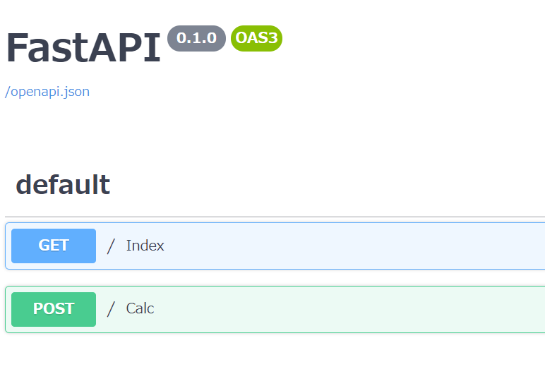

import { Link } from 'gatsby'

どうもカニヤです。

最近**テック系の記事**を読んでいたら、今**勢いがある FastAPI**と言うものを見つけました。

気になり調べてみたら、**名前の通り API を構築するための Python の Web フレームワーク**だと分かり。

Python の Web フレームワークなら**パイソニスタ**を目指している自分が使わない理由はないと思い。<br/>
さっそく、**FastAPI で簡単な WebAPI**を作ってみました。

という事で,今回は**FastAPI を使っての API の構築の仕方**を紹介したいと思います。

**\この記事はこういう人におすすめ/**

<blockquote display="info">

- FastAPI を知らない人
- API を構築してみたい人

</blockquote>

### インストール

---

<br />

最初に**FastAPI**をインストールします。

`pip install fastapi`

また、サーバーとして動作するのに必要な**uvicorn**をインストールします。

`pip install uvicorn`

これで**API 構築に必要な物**のインストールは完了です。

### API 構築

---

<br />

今回は**超簡単な税込み価格を出すだけの API**を作ります。

では早速、コードを書いていきたいと思います。

まず、**fast_api というフォルダー**とその中に**main.py**を作成。

```python
from fastapi import FastAPI
from pydantic import BaseModel

class TaxIn(BaseModel):
    cost: int
    tax: float

app = FastAPI()

@app.get("/")
def index():
    return {"message": "Hello World"}

@app.post("/")
def calc(data: TaxIn):
    tax_cost = data.cost * data.tax
    return {'税込み価格': tax_cost}
```

**インポートした BaseModel**と言うのは、**型推論**に使います。<br/>
これをすることで**cost には int 型**しか代入できず、**tax には float 型**しか代入できなくなります。

そして、API が呼ばれた時の**引数 data に TaxIn の型**を当てる。

これで**API 側のコード**は完了です。

なので、一旦動かしてみたいと思います。

ターミナルを開き、

`uvicorn fast_api.main:app --reload`

と打ち込みます。

そうするとローカルで立ち上がるので、URL をクリックします。<br/>
**作成した API の詳細**を見るには、先ほどの**URL の後ろに/docs**と追加する。

そうすると、このような画面になり詳細が分かります。


次に API を呼び出すために、先ほどの fast_api フォルダーの**外に test.py**を作成。

```python
import requests
import json

def main():
    url = ''
    data = {
        'cost': 100,
        'tax': 1.1
    }

    # ここでAPIを呼び出す,データはjson形式ではないとエラーが起きる
    res = requests.post(url, json.dumps(data))
    print(res.json())

if __name__ == '__main__':
    main()

```

これで**呼び出し側のコード**も完成です。

先ほどのターミナルを開いたまま、**別のターミナルを開き python test.py**と打ちます。

そうすると{'税込み価格': 110.00000000000001}と表示されると思います。

### まとめ

---

<br />

今回は**FastAPI を使った WebAPI の構築の仕方**を紹介しました。

**税込み価格を出すだけ**の簡単な API だったこともあり、<br/>
**圧倒言う間**に作成できました。

FastAPI は**公式ドキュメント**がかなり細かく分かりやすく書いてあるので、<br/>
これを機に**興味を持った人**はぜひ見てみて下さい。

今後**きちんとした API**を作成したら、記事にしたいと思います。

最後まで読んでくださりありがとうございます。

**Python に関する記事**は他にも書いているので、<br/>
**興味がある方**はぜひ読んでみてください。

<Link to="/category/Python" className="btn center-btn">
  関連記事
</Link>

---
