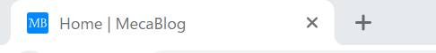
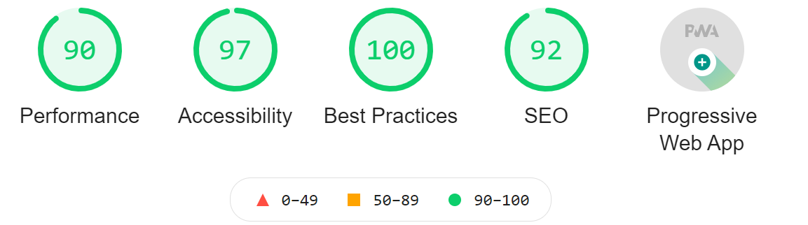

import { Link } from 'gatsby'

<div className="ballon ballon-left">
  ブログのアイコン、デフォルトのままだと嫌だな。 でも、お金を掛けて作るのもな~
</div>

と悩んでいませんか？

わたしは、これから**解説する方法**で<br/>
**ブログのアイコンを無料**で作りました。

この記事は**5 分ぐらいで簡単**に読めるので、

この記事を最後まで読んでいただければ、<br/>
**あなたはオリジナルのアイコン**を手にすることができます。

ちなみにここで言う**アイコンは favicon です。**

今回は**Gatsby.js での favicon の設定**をベースに**無料の作成方法**<br/>
を解説したいと思います。

もちろん、ここで作成した favicon は**Gatsby 以外**でも使えます。

<div className="ballon ballon-left">
  分かってる前提で話しているけど、いきなりfaviconと言われても分からない
</div>

と言う人のために、<br/>
はじめに**favicon**とは何か説明したいと思います。

### favicon とは

---

<br />

**タブ**表示した時や**ブックマーク**した時の<br />
ページ名の横に付いている**アイコン**が<br />
**favicon**です。



↑ 具体的に言うとこれの事です。

### favicon 作成ツール

---

<br />

やっぱり自分のブログなので、<br />
オリジナルの**favicon**を作成した方が<br />
**愛着**が持てます。

なので、**favicon を自分で無料で作れるツール**を教えます。

<span className="line line-yellow">おすすめするツールは favicon.io です。</span>
<br />
<br />

<Link to="https://favicon.io/" className="linkcolor link-text">
  https://favicon.io/
</Link>
<br />
<br />

**favicon.io おすすめポイント**

<blockquote display="info">

- 画像・テキスト・絵文字の３つから作成できる
- 色・大きさ・フォントをカスタマイズできる
- 無料

</blockquote>

個人的には**テキスト**から作成するのが、<br />
一番簡単で良いと思います。

他にも**favicon 作成ツール**はあるので、<br />
自分に合ったものをぜひ探してみてください。

### favicon 設定方法

---

<br />

はじめにプラグインを**インストール**します。

`npm install gatsby-plugin-manifest`

次に gatsby-config.js に設定します。

```js
// in gatsby-config.js
module.exports = {
  plugins: [
    {
      resolve: `gatsby-plugin-manifest`,
      options: {
        name: `GatsbyJS`,
        short_name: `GatsbyJS`,
        start_url: `/`,
        background_color: `#f7f0eb`,
        theme_color: `#a2466c`,
        display: `standalone`,
        icon: `faviconのあるファイルのパス`, //ここ
      },
    },
  ],
}
```

これで**gatsby ブログに favicon**を設定できました。

### まとめ

---

<br />

今回は**ブログのアイコンを無料で作る方法**をご説明しました。

<span className="line line-yellow">
  favicon.ioがあれば無料でオリジナルの faviconが作れる。
</span>
<br />
<br />

これだけ覚えてもらえれば**問題ない**と思います。

自分のブログを持っている人は<br/>
自分だけの**favicon がある方**が、<br/>
**オリジナリティ**があり良いと思うので、<br/>
これを機にぜひ**自分だけの favicon**を作ってみてください。

### 余談

---

<br />

余談ですが、このブログの**パフォーマンス値**が<br />
**オール 90**を越えました！



今度は**オール 100**を目指してがんばりたいと思います。

分析に使ったこの**LightHouse**は<br/>
ブログの**パフォーマンス値**と**改善点**を<br/>
教えてくれるので、<br/>
**興味がある人**はぜひ使ってみてください。

---
