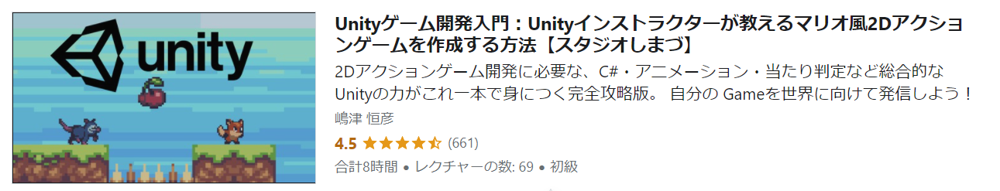
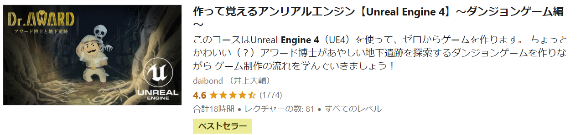

import { Link } from 'gatsby'

どうもカニヤです。

突然ですが、**ゲーム**は好きですか？

**私は大好きです!**

ゲーム好きな人は**自分で作ってみたい**と一度は考えたことがあると思います。

しかし、

どのゲームエンジン使えばよいの？

 

  ゲーム開発のプログラミング言語って何？

と言った感じで、悩んだことありませんか？

私もはじめはそういう理由で悩みゲームプログラミング出来ませんでした。

そういった悩みを解決するために、 
この記事では**おすすめの言語とおすすめのゲームエンジンを紹介！**

この記事を読めば、**言語とゲームエンジン選びに迷うこと**はなくなります。

### おすすめのゲームエンジン

---

 

今回紹介するのはこの 2 つです。

<blockquote display="info">

- Unity
- Unreal Engine

</blockquote>

正直個人でゲーム開発するなら、**この 2 つ以外の選択肢はない**と言っても過言じゃありません。

何が一番すごいかと言うと**２つとも無料で使える点**です。

実際に**２つとも使ってみた私の見解**を述べたいと思います。

**Unity の特徴**

<blockquote display="default">

- 日本語の記事が多い
- ２ D・３ D 両方作れる
- 様々な機器に対応している
- アニメ調のゲーム開発に優れている

</blockquote>

Unity
は日本語の記事が多いので、比較的勉強しやすいです。
 
 

様々な機器に対応していると言うのは、 
Unity は**PC・スマホ・VR などのゲーム**も作れます。

また、一番の特徴はアニメ調のゲームを作れる点

アニメ調のゲームを見かけたら**全部 Unity**だと思っていいぐらいです。(笑)

作品例：原神、ポケモン GO、Fall Guys

**Unreal Engine の特徴**

<blockquote display="default">

- CG 映像に優れている
- プログラミングなしでゲームが作れる
- 様々な機器に対応している
- 現実さながらのリアルなゲームを作れる

</blockquote>

Unreal Engineはフォートナイトで有名な Epic
gamesが開発したゲームエンジン。
 
 

こちらも**様々な機器のゲーム**を作ることができます。

Unreal Engine は**映像表現に優れている**ので、 
CG の映像を作るのに向いていると思います。

何と言っても Unreal Engine の大きな特徴は圧倒的にリアルなゲームを作れる点。

また、**ブループリントを使うことでプログラミングなし**でゲーム開発ができる点です。

**ブループリント**はノードベースのインタフェースを使用して、
スクリプトをゲームに**視覚的**に追加していくシステムです。

言葉で説明してもいまいち分からないと思うので、**実際に触ってみるのが一番！**

作品例：ドラゴンクエスト Ⅺ、フォートナイト、ファイナルファンタジー Ⅶ リメイク

---

**総評する**とどちらも素晴らしいです。

しかし、**Unreal Engine**は機能が多い分**複雑**なので、気持ち初心者向けなのは Unity です。

**一度２つとも使ってみるのが良い**と思います。

そんな**時間はないという人**は、

**アニメ調のゲーム**を作りたいなら **Unity** 
**リアルなゲーム**を作りたいなら**Unreal Engine**

を使ってみるのを**おすすめ**します。

### おすすめ言語

---

 

<blockquote display="info">

1. C#
2. C++
3. java
4. swift

</blockquote>

先に**ゲームエンジンで使う言語**から紹介します。

1: C#は Unity
でスクリプトを書く時に使うのでおすすめです。
 
 

C 系の言語は比較的**難しい**ですが、 
Unity の**公式チュートリアル**は分かりやすいので、 
**C＃初心者**でもチュートリアルを見ながら簡単に開発できます。

(Unity は**スクリプトなしでも簡単なゲームなら作る事**ができます)

2: C++は UnrealEngine
でスクリプトを書く時に使うのでおすすめです。
 
 

Unreal Engine には**ブループリントがある**ので、 
自分の使いたい方を選ぶのが良いと思います。

とは言っても、**両方使えた方**がゲーム開発の幅は広がります。

最近は**大手ゲーム会社**も**自社エンジン**ではなく、 
**Unity と Unreal Engine**を使うことが増えている。

そのため、**ゲームエンジニアを目指している人は C#・C++ともに使える方が良い**と思います。

---

次に**スマホゲームを作る際のおすすめ言語**を紹介します。

3:Javaは
Androidアプリを作る際に良く使われる言語なので、

**Android のスマホゲームを開発したい人**におすすめです。

4: Swiftは iOS アプリを作る際に使われる言語なので、

**iPhone のスマホゲームを開発したい人**におすすめです。

### おすすめの勉強法

---

 

**ゲームエンジンとプログラミング言語**だけでなく、**勉強法**も知りたいと言う人のために 
**おすすめの勉強法**を紹介したいと思います。

**大事なこと**なので、最初に言っときます。

いっさいの**プログラミング経験がない人**が

  最初に Unity と UnrealEngine を使うのはおすすめしません！

 
 

２つは確かに**簡単にゲーム開発**ができます。

しかし、**プログラミング経験のない人**がいきなりやるのは、

~**スライムを倒したことがない人がボスに挑むようなもの**~です。

なので、私は**最初のゲームプログラミングの勉強**として、
以下の**2 つ**をおすすめします。

<blockquote display="info">

- Scratch
- ナビつき! つくってわかる はじめてゲームプログラミング

</blockquote>

Scratch
は視覚的にプログラミングを組むことができる無料の教育プログラミング言語。
 
 

教育を目的として開発された言語なので、**プログラミングの入門**としてピッタリです。

Scratch は**２ D のゲーム**なら簡単に作ることができる。そのため、最初の勉強として**おすすめ**します。

**次に**おすすめするのはナビつき! つくってわかる はじめてゲームプログラミング
です。

これは 2021 年 6 月に任天堂から発売され、 
現在 Amazon で**800 件以上のレビューと星 4.3 の評価**を得ているゲーム。

子供向けのゲームと思いきや,**かなり本格的なゲームプログラミングソフト**です。

とは言っても、先ほどの Scratch と違って**switch とソフトの代金**が掛かってしまいます。 
（ソフトは**Amazon だと 3000 円**で買えます。2021 年 8 月時点）

しかし、**自己投資と思い**、それぐらいの出費は気にならない人には 
タイトルの通り、**はじめてのゲームプログラミングの勉強**としておすすめです！

 

  <a
    href="//af.moshimo.com/af/c/click?a_id=2774523&p_id=170&pc_id=185&pl_id=4062&url=https%3A%2F%2Fwww.amazon.co.jp%2F%25E4%25BB%25BB%25E5%25A4%25A9%25E5%25A0%2582-%25E3%2583%258A%25E3%2583%2593%25E3%2581%25A4%25E3%2581%258D-%25E3%2581%25A4%25E3%2581%258F%25E3%2581%25A3%25E3%2581%25A6%25E3%2582%258F%25E3%2581%258B%25E3%2582%258B-%25E3%2581%25AF%25E3%2581%2598%25E3%2582%2581%25E3%2581%25A6%25E3%2582%25B2%25E3%2583%25BC%25E3%2583%25A0%25E3%2583%2597%25E3%2583%25AD%25E3%2582%25B0%25E3%2583%25A9%25E3%2583%259F%25E3%2583%25B3%25E3%2582%25B0-Switch%2Fdp%2FB093WDM64Q"
    rel="nofollow"
    referrerpolicy="no-referrer-when-downgrade"
    className="text-red"
  >
    Amazonで見る
  </a>
  

  <a
    href="//af.moshimo.com/af/c/click?a_id=2751507&p_id=54&pc_id=54&pl_id=616&url=https%3A%2F%2Fitem.rakuten.co.jp%2Fjism%2F4902370548174-54-46586-n%2F"
    rel="nofollow"
    referrerpolicy="no-referrer-when-downgrade"
    className="text-blue"
  >
    楽天市場で見る
  </a>
  

 
 

ある程度**勉強して、知識も身についたら** 
次は**Udemy で勉強する**のが良いと思います。

  Udemy はプログラミングの世界最大級のオンライン学習サイトです。

Udemy については、<Link to="/posts/intro" className="linkcolor link-text">こちらの記事</Link>で解説してます。

私も途中からは Udemy で学習しました。

実際にやって良かった**おすすめの講座を２つ**紹介したいと思います。

**Unity でおすすめの講座**

<a
  href="https://px.a8.net/svt/ejp?a8mat=3HIGXH+87WGFM+3L4M+BW8O2&a8ejpredirect=https%3A%2F%2Fwww.udemy.com%2Fcourse%2Fstudio_shimazu_sideview_action%2F"
  rel="nofollow"
>
  Unityゲーム開発入門：Unityインストラクターが教えるマリオ風2Dアクションゲームを作成する方法【スタジオしまづ】
</a>

 
 

**Unreal Engine でおすすめの講座**

<a
  href="https://px.a8.net/svt/ejp?a8mat=3HIGXH+87WGFM+3L4M+BW8O2&a8ejpredirect=https%3A%2F%2Fwww.udemy.com%2Fcourse%2Funreal-engine-4-award%2F"
  rel="nofollow"
>
  作って覚えるアンリアルエンジン【Unreal Engine 4】～ダンジョンゲーム編～
</a>

 
 

この 2 つが個人的に**初心者でも分かりやすく**、
やる内容も**簡単過ぎず**良かったです。

### まとめ

---

 

今回**ゲームプログラミングのおすすめ言語・エンジン・勉強法**を紹介しました。

**Unity と Unreal Engine**は両方素晴らしいので、 
**一度２つとも使ってみること**をおすすめします。

言語に関しては**これが一番良いと言うモノはない**ので、 
自分が**使いたいエンジンや開発したいゲームの機器**によって選べば良いと思います。

思い立ったが吉日
 
 

まずは**Scratch など無料で簡単に作れるもの**から始めてみましょう。

そして、知識がある程度**身についてきたら**、 
**Udemy で本格的に勉強する**のがおすすめです。

個人的に一番**ゲーム開発で大切**なのは 
**童心を忘れない事**だと思います。

最後まで読んでくださり**ありがとうございます**。

---
