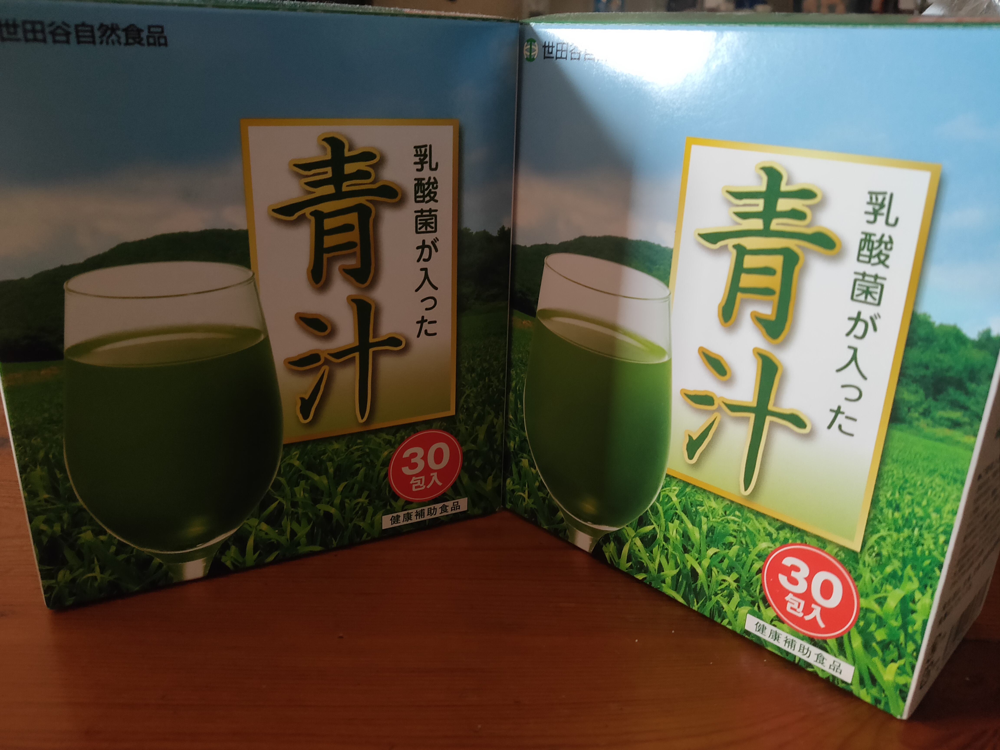

import { Link } from 'gatsby'

どうもカニヤです。

2021 年も**上半期が過ぎ、下半期を迎えよう**としてます。

なので、2021 年上半期に**本当に買ってよかったもの**を紹介したい思います。

今年は去年に続き、家にいる事がほとんどだったので、 
基本**紹介するものはインドア商品や生活品**です。

さっそくいきましょう！

### ベスト 5 　世田谷自然食品　青汁

---

 

自分は**抹茶が好き**なので、その延長線で買いました。

この青汁は**乳酸菌が入っていて健康に良い**ので、 
今の時期はピッタリ。また、**単純においしい。**

自分は**色々な飲み方**を試しましたが、 
**一番おいしい飲み方は牛乳で飲むやり方**ですね。

まあプロテインと同じで**水で飲むのが吸収が早く良い**ですが、
**毎日同じ飲み方じゃ飽きる**ので、私は基本的には**牛乳と交互**に飲んでいます。

これ以外の飲み方も 1 つだけ紹介します。 
それは**カルピスで飲むやり方**です。

味はどんな感じ方と言うと、**フルーツ青汁もしくはネスレのケール＆フルーツの味。** 
なので、**この飲み方をするなら**フルーツ青汁かケール＆フルーツを**買った方がいい**です。

\こういう人におすすめ/

- 健康を気にしている人
- 青汁が好きな人

  <a
    href="//af.moshimo.com/af/c/click?a_id=2774523&p_id=170&pc_id=185&pl_id=4062&url=https%3A%2F%2Fwww.amazon.co.jp%2Fdp%2FB00YO5ZFCA%3Ftag%3Dmaftracking-22%26linkCode%3Dosi%26th%3D1%26psc%3D1"
    rel="nofollow"
    referrerpolicy="no-referrer-when-downgrade"
  >
    Amazonで見る
  </a>
  

  <a
    href="//af.moshimo.com/af/c/click?a_id=2751507&p_id=54&pc_id=54&pl_id=616&url=https%3A%2F%2Fitem.rakuten.co.jp%2Fzeroone777%2Fseta-aojiru%2F%3Fscid%3Daf_pc_etc%26sc2id%3Daf_103_1_10000645"
    rel="nofollow"
    referrerpolicy="no-referrer-when-downgrade"
  >
    楽天市場で見る
  </a>
  

 
 

### ベスト 4 　ペリエ

---

 

夏なので、**爽やかな炭酸水が飲みたくて買いました。**

**このペリエは**今までのデザインとは違って**容器が透明になった**ので、
**ごみ捨ての時、**普通のペットボトルと**分ける必要がなくなったのが良い点**です。

普通の炭酸水と違って**プレーンでも味がしっかりある**ので、
何かと割って飲むのではなく**ペリエ単体で飲むのがおすすめ**です。

**特に暑い日の風呂上りに飲むペリエは格別！**

このペリエはデザインは違いますが**緑色のペリエと味に関しては特に違い**はありません。

ペリエはペットボトル以外にも**瓶や缶。また、ライム味**などあります。

私は**瓶は飲んだことがない**ので分からないのですが、**缶とペットボトルでは微妙に味が違います。**

**プレート・ライムどちらが良いか**は人それぞれなので、
何とも言えませんが**私は気持ちプレーンの方が好きです。**

\こういう人におすすめ/

- ペリエを飲んだことがない人
- 炭酸水が好きな人

  <a
    href="//af.moshimo.com/af/c/click?a_id=2774523&p_id=170&pc_id=185&pl_id=4062&url=https%3A%2F%2Fwww.amazon.co.jp%2Fdp%2FB084T9182T%3Ftag%3Dmaftracking-22%26linkCode%3Dosi%26th%3D1%26psc%3D1"
    rel="nofollow"
    referrerpolicy="no-referrer-when-downgrade"
  >
    Amazonで見る
  </a>
  

  <a
    href="//af.moshimo.com/af/c/click?a_id=2751507&p_id=54&pc_id=54&pl_id=616&url=https%3A%2F%2Fitem.rakuten.co.jp%2Fsoukaidrink%2F11717%2F%3Fscid%3Daf_pc_etc%26sc2id%3Daf_103_1_10000645"
    rel="nofollow"
    referrerpolicy="no-referrer-when-downgrade"
  >
    楽天市場で見る
  </a>
  

 
 

### ベスト 3 　タップボール

---

 

このタップボールは**自粛期間中の運動不足解消と動体視力のトレーニングのため**に買いました。

実際**ほぼ毎日使ってる**ので、**運動不足の解消**になってます。

**動体視力**に関しては**目がかなり悪い**ので、 
**良くなっているのか**イマイチ分かりません。(笑)

しかし、これも**買ってよかった**と思っています。

\こういう人におすすめ/

- 運動不足な人
- 動体視力を鍛えたい人

注意！

<blockquote display="warning">

はじめの慣れない内は**ひもが目にぶつかる事**がよくあります。 
なので、タップボールを使う時は**メガネや目を保護するものを付けて使うこと**を勧めます。

</blockquote>

  <a
    href="//af.moshimo.com/af/c/click?a_id=2774523&p_id=170&pc_id=185&pl_id=4062&url=https%3A%2F%2Fwww.amazon.co.jp%2Fdp%2FB07G126DQK%2Fref%3Dsspa_dk_detail_2%3Fpsc%3D1%26pd_rd_i%3DB07G126DQK%26pd_rd_w%3DzZNDc%26pf_rd_p%3D110dd359-2c41-4df7-8ba6-72574215696b%26pd_rd_wg%3DDmmv7%26pf_rd_r%3DVZ056FFR2JEM7HK9PNTA%26pd_rd_r%3D388d711c-58e1-43d0-a101-31c17de2402d%26spLa%3DZW5jcnlwdGVkUXVhbGlmaWVyPUExQkg0MDVNSUNXOVJUJmVuY3J5cHRlZElkPUEwMzA2NzEwMTRNRFozTVUyRUREQiZlbmNyeXB0ZWRBZElkPUEyOTNZSE41U1daSlJFJndpZGdldE5hbWU9c3BfZGV0YWlsJmFjdGlvbj1jbGlja1JlZGlyZWN0JmRvTm90TG9nQ2xpY2s9dHJ1ZQ%3D%3D"
    rel="nofollow"
    referrerpolicy="no-referrer-when-downgrade"
  >
    Amazonで見る
  </a>
  

  <a
    href="//af.moshimo.com/af/c/click?a_id=2751507&p_id=54&pc_id=54&pl_id=616&url=https%3A%2F%2Fitem.rakuten.co.jp%2Fhigosports%2Fism-tap-01%2F%3Fscid%3Daf_pc_etc%26sc2id%3Daf_103_1_10000645"
    rel="nofollow"
    referrerpolicy="no-referrer-when-downgrade"
  >
    楽天市場で見る
  </a>
  

 
 

### ベスト 2 　タブレットスタンドデスク

---

 

これは**iPad をパソコンの隣に置いて作業したいと思った**ので買いました。

タブレットを**安定して立てて使える**ので、 
**少し大きめのタブレットを持っている人**はかなり役に立つと思います。

**思った以上に安定して立てられる**のと**角度の調節をできる**のが便利。 
また、**本立てとして使えないこと**もない。(笑)

これが**あるとじゃ、ないとじゃ**作業効率が**雲泥の差**なので、
**本当に買ってよかった**と思います。

\こういう人におすすめ/

- タブレットをよく使う人

 

  <a
    href="//af.moshimo.com/af/c/click?a_id=2774523&p_id=170&pc_id=185&pl_id=4062&url=https%3A%2F%2Fwww.amazon.co.jp%2Fdp%2FB06XG7XJ8K%3Ftag%3Dmaftracking-22%26linkCode%3Dosi%26th%3D1%26psc%3D1"
    rel="nofollow"
    referrerpolicy="no-referrer-when-downgrade"
  >
    Amazonで見る
  </a>
  

  <a
    href="//af.moshimo.com/af/c/click?a_id=2751507&p_id=54&pc_id=54&pl_id=616&url=https%3A%2F%2Fitem.rakuten.co.jp%2Flomicall%2Fs1-rt-s%2F"
    rel="nofollow"
    referrerpolicy="no-referrer-when-downgrade"
  >
    楽天市場で見る
  </a>
  

 
 

### ベスト 1 　ツクエアロ２

---

 

最後に紹介するのは**ツクエアロ２**になります。

ツクエアロ２が**2021 年上半期で一番買ってよかったもの**です。

そういうこともあり、この記事で解説すると**長くなってしまう**ので、

ツクエアロ２に関しては**こちらのレビュー記事の方**で詳しく書いています。

記事：<Link to="/posts/tukue" className="linkcolor link-text">【レビュー】ツクエアロ２使ってみた感想</Link>

\こういう人におすすめ/

- 運動不足な人
- 作業しながら運動したい人

  <a
    href="//af.moshimo.com/af/c/click?a_id=2751507&p_id=54&pc_id=54&pl_id=616&url=https%3A%2F%2Fitem.rakuten.co.jp%2Fmikawa3r%2F3r-abk02%2F%3Fscid%3Daf_pc_etc%26sc2id%3Daf_103_1_10000645"
    rel="nofollow"
    referrerpolicy="no-referrer-when-downgrade"
  >
    楽天市場で見る
  </a>
  

 
 

### まとめ

---

 

\上半期買ってよかったものBEST5/

<blockquote display="info">

- ベスト 5 　世田谷自然食品　青汁
- ベスト 4 　ペリエ
- ベスト 3 　タップボール
- ベスト 2 　タブレットスタンドデスク
- ベスト 1 　ツクエアロ２

</blockquote>

上記の**５つが上半期買ってよかったもの**でした。

やっぱり**こんな時期**なので、ラインナップが**インドア商品や生活品だけ**になりました。

しかし、こんな時期だからこそ**コツコツとプログラミング技術を学んだり**、
**ブログ記事を書いたりすることに専念できる**ので、

  今の状況で自分ができることをただ精一杯やりたいと思います。

 
 

最後まで読んでいだだきありがとうございました。

---
