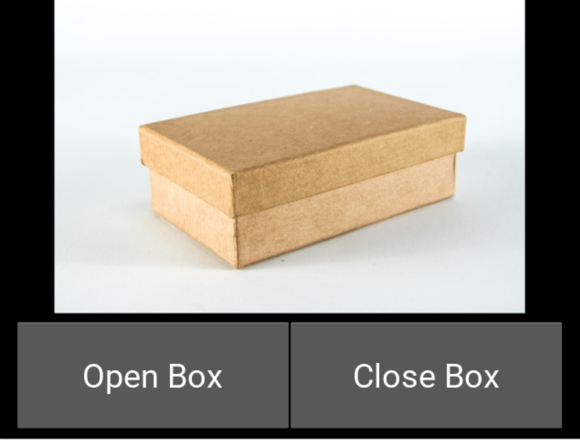
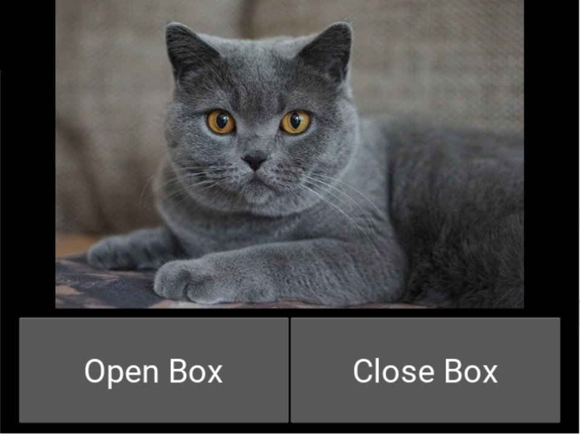

import { Link } from 'gatsby'

どうもカニヤです。

Python には**沢山のライブラリ**があるので、面白いものがないか
調べていたら**GUI アプリ**を作成できる**Kivy と言うライブラリ**を見つけました。

GUI アプリは**作った事が無かった**ため、**初挑戦!**

実際に触ってみて**楽しかった**ので、記事を書くことにしました。

そういうことで、今回は**Kivy を使った GUI アプリの作成方法**を紹介します。

**\この記事はこういう人におすすめ/**

<blockquote display="info">

- kivy を知らない人
- GUI アプリを作ってみたい人

</blockquote>

### はじめに

---

<br />

今回作成する GUI アプリは**シュレーディンガーの猫**をイメージして、<br/>
ボタンを押すとランダムで**猫が起きている画像・寝ている画像**に切り替わるアプリを作成します。

（本来のシュレーディンガーの猫は確率ではないが、今回はこういう仕様で実装する。）

はじめに**Kivy をインストール**します。

`pip install kivy`

これで**環境構築**は完了。次にコードを書いていきます。

### Python 実装

---

<br />

```python
from kivy.app import App　
from kivy.uix.widget import Widget　
from kivy.properties import StringProperty
from random import randint

```

まず今回使うものをインポートします。

App は**このアプリを動かす**のに使い、
Widget は**表示するものをカスタマイズする**ために使い、
そして、StringProperty は**デフォルト画像を設定する**のに使う。

```python

class ImageWidget(Widget):
    source = StringProperty('./images/box.jpg')　# 箱の画像

    def __init__(self, **kwargs):
        super(ImageWidget, self).__init__(**kwargs)
        pass

    def closeBox(self):
        self.source = './images/box.jpg'

    def openBox(self):
        num = randint(0,1)
        if num == 0:
            self.source = './images/sleepcat.jpg' # 寝ている猫の画像　数値が0の時
        else:
            self.source = './images/livecat.jpg' #　起きている猫の画像　数値が1の時

class MainApp(App):
    def __init__(self, **kwargs):
        super(MainApp, self).__init__(**kwargs)


if __name__ == '__main__':
    MainApp().run()

```

このファイルと**同じディレクトリ階層**に images フォルダを作り、<br/>
そこに今回使う**箱の画像と猫の画像 2 枚**を入れます。

はじめに**ImageWidget クラス**を作り、そこに**Widget**を渡します。<br/>
次に**画像のパスを入れる source**にデフォルト画像として箱の画像を**StringProperty**で設定します。

そして、ボタンを**押した時のイベント**を書きます。<br/>
**閉じた時**のイベントを**closeBox**として、source に**箱画像のパス**を渡します。

**開ける時**のイベントを**openBox**として、**randint**で 0 と 1 がランダムに出るようにして、<br/>
**0**の時に**寝ている猫の画像のパス**を渡して、**1**の時に**起きている猫のパス**を渡す。

これでひとまず**Python のコード**は終わりです。<br/>
次から**Kivy のコード**を書いていきます。

### Kivy 実装

---

<br />

**Kivy ファイルの拡張子**は〇〇.kv とします。

<span className="line line-yellow">
  〇〇には先ほど自分が書いていたPythonファイルの名前を入れる。
</span>
＊ここ重要！{' '}

（この記事では main.kv とする）

```kivy
ImageWidget:

<ImageWidget>:

    BoxLayout:
        orientation: 'vertical'
        size: root.size

        Image:
            source: root.source

        BoxLayout:
            size_hint_y: 0.4
            padding: 20,10,20,10
            Button:
                id: button1
                text: 'Open Box'
                font_size: 36
                on_press: root.openBox()

            Button:
                id: button2
                text: 'Close Box'
                font_size: 36
                on_press: root.closeBox()
```

**ImageWidget：**の下に書くことで**表示される見た目**を設定できます。

まず BoxLayout で**全体を囲み**、**orientation: 'vertical'**と設定することで**縦並び**になる。
**Image：**の部分で画像が表示される。

そして、また BoxLayout で囲み size_hint_y で**画像の大きさを元にボタンの大きさを決める**よう設定。
あと padding:で**パディング**も設定。

続いて、**ボタンの設定**をしていきます。
ここの設定で**一番重要**なのは、<span className="line line-yellow">on_press の設定</span>です。

**Open Box ボタンの方**に先ほど Python で書いた関数の**openBox()**,
**Close Box ボタンの方に closeBox()**を設定すれば完了です！

これで**Python ファイル**を実行すれば、このように表示されると思います。



**Open Box ボタンを押す**とこうなります。



### まとめ

---

<br />

今回**Kivy を使った GUI アプリの作成方法**を紹介しました。

はじめてなので途中詰まるところも少しありましたが、<br/>
**簡単に GUI アプリを作成すること**ができました。

これからも**Python の面白そうなライブラリ**が見つかったら、<br/>
また**記事にしよう**と思います。

最後まで読んでくださりありがとうございます。

**Python に関する記事**は他にも書いているので、<br/>
**興味がある方**はぜひ読んでみてください。

<Link to="/category/Python" className="btn center-btn">
  関連記事
</Link>

---
