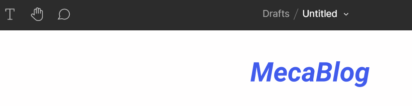
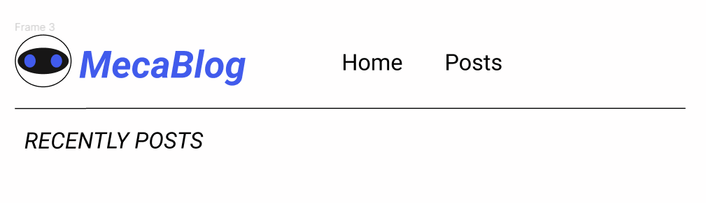
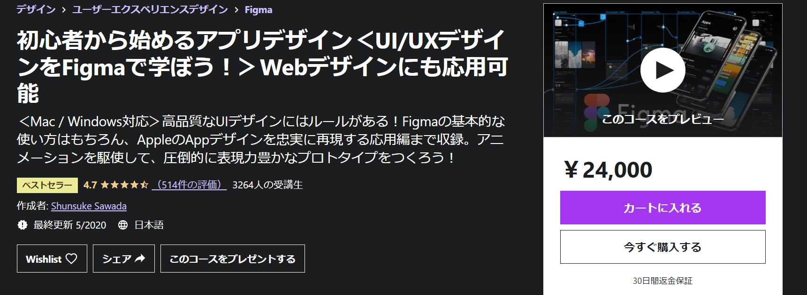

import { Link } from 'gatsby'

どうもカニヤです。

MecaBlogもついに20 記事を越えました！

これを記念して**ブログのヘッダーロゴを作成しよう**と思います。

やっぱり**MY ブログ**なので、**自分で作成したロゴ**を使いたいと思い、 
**前々から学習していた**事と**SVG で出力できる**といった理由から**Figma を使いロゴ作成**しました。

という事で、今回は**Figma でのヘッダーロゴの作成方法**を紹介します。

### Figma 始め方

---

 

まず<Link to="https://www.figma.com/" className="linkcolor link-text">公式サイト</Link>にアクセスして、**アカウント登録**します。 
Figma は**有料版**もありますが、**デザイナーでもない限り個人で使う分**には**無料で十分**です。

**メールアドレスとパスワード**を入力すると**利用目的や役職**など聞かれますが、 
これらは**後から変更**できます。

それらを入力したら**アカウント登録完了**です。

<blockquote display="info">

Figma は**デスクトップバージョンもある**のですが、今回は**ブラウザ版**でやります。

</blockquote>

### ヘッダーロゴ作成

---

 

最初に**Drafts**を開き、**+New ボタン**から**Design File**を押します。

そうすると**白いキャンバスの様な画面**になります。

そしたら、いよいよ**デザイン開始**です。

まず**上の Navbar の T のボタン**を押して、**テキスト入力モード**にします。 
そして、**自分のブログタイトル**を入力。（私は MecaBlog）

それから、タイトルをクリックして**Text と Fill の部分**をいじり、
現在のブログの**タイトルの色と大きさ**になるように変更。

変更後

 

ロゴデザインは**初めて**なので**奇をてらわず**、今回は MecaBlog の**Meca**から取って**ロボットをタイトルの横に付けるシンプルなデザイン**にしたいと思います。

**ブログの色彩の調和**を崩さないように、**白・黒・青の三色**を使う。

はじめに**上の Navbar から〇の Ellipse**を選びます。

<blockquote display="default">

1. **横幅 60、縦幅 56 の白い丸**を１つ。

2. **横幅 54、縦幅 28 の黒い円**を 1 つ。

3. **横幅 12、縦幅 14 の青い円を２つ**作って完成！

</blockquote>

それらを良い感じに並べ替えて、**全部を選択した状態**で 
**右クリックで Frame selection**を押して**一塊**にします。

**タイトルの横に並べる**とこんな感じです ↓

 

最後に**先ほどのようにロゴとタイトルを全部を選択**して、
**右クリックで Frame selection**を押して**一塊**にします。

そして、その一塊をクリックして**一番下の export を押して、**
**好きな形式**を選択して**ボタンを押せば**完了！（私は SVG を選択）

### まとめ

---

 

今回は**Figma でのヘッダーロゴの作成方法**を紹介しました。

**初めてのロゴ作成**だったので、**シンプルなデザイン**にしました。

今後**良いデザインが思い浮かんだら**、ロゴを変更すると思います。(笑)

**Figma を使えば簡単に作成できる**ので、フリー素材を使うのではなく**自分でロゴを作る事をおすすめ**します。

  \Figma を学びたい人はこの Udemy 講座がおすすめ/

 
 

 

  <a
    href="https://px.a8.net/svt/ejp?a8mat=3HIGXH+87WGFM+3L4M+BW8O2&a8ejpredirect=https%3A%2F%2Fwww.udemy.com%2Fcourse%2Ffigma-app-design%2F"
    rel="nofollow"
  >
    Udemy公式サイトで見る
  </a>
  

 
 

---
