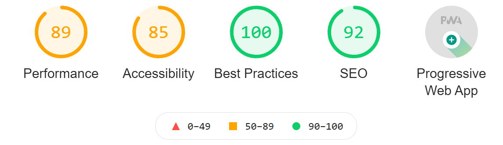

### 1. 東京オリンピック

**オリンピック**が始まり、最近そればっかり見ていて。 
4 日ぶりの投稿になってしまいました。 
すでに日本は多くのメダルを獲得しているので、非常に嬉しいです。

**サッカー**が一番好きなので、サッカー日本代表には 
ぜひメダルを取ってほしいと思います。

### 2. このブログを Lighthouse で判定した結果

話題は変わりますが、 
それなりにブログも出来てきたので、 
サイトのパフォーマンス値を出してくれる** Lighthouse** を使いました。

結果はこんな感じでした。 
まだまだ改善の余地が大いにあるため、頑張っていきたいと思います。

数値だけでなく**細かい改善点**も教えてくれるので、 
私みたいな初心者ブロガーはぜひ使ってみてください。

## まとめ

このブログは**オリンピック日本代表**を応援しています。
