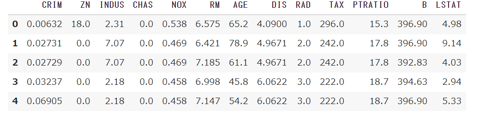

### - はじめに

---

<br />

Python の基礎をある程度覚えたから、<br/>
もうちょっと進んで**スクレイピング**とかしたい。

でも**Beautifulsoup・Selenium**使ってやるのは、<br/>
少し難しそうだなと思った人いませんか？

実はわたしもそう思い、<br/>
スクレイピングを躊躇していました。

しかし、**この方法**をきっかけにそういう思いも消え。<br/>
今では何の不安もなく**スクレイピング**ができるようになりました。

そのため、今回その方法を<br/>
スクレイピングをやったことのない人<br/>
に紹介したいと思います。

### - 結論 read_html を使う

---

<br />

結論から言うと、**Python**のデータ分析に優れたライブラリである。<br/>
**Pandas** の関数の**read_html**を使います。

簡単に説明するとこれを使用することで、<br/>
指定した Web サイト上のテーブルからデータを**簡単**に取って来ることができます。

さっそく **read_html の使い方**を説明したいと思います。<br/>
最初に Pandas をインストールします。

`pip install pandas`

インストールが終わったら、import します。

```python
import pandas as pd
```

**as pd**とすることで、<br/>
コードを書く時 pandas を pd と短縮して使うことができます。

次に取得したいデータがあるサイトの Url を書き。<br/>
read_html に渡します。

```python
url = "取得したいデータがあるサイトのUrl"
data = pd.read_html(url)[インデックス番号]
```

**url 引数**は必須なので、忘れず read_html に渡しましょう。

指定したサイト内にテーブルが複数あると、<br/>
**意図していないデータ**を取得する。

そうならないように、取得したいテーブルのインデックスを指定するために<br/>
後ろに**[インデックス番号]**を書きます。



データを取得することができました。

### - まとめ

---

<br />

**Beautifulsoup・Selenium**を使わず、<br/>
たったこれだけのことでデータを取得することができました。

しかし、**本格的なスクレイピング**をするなら<br/>
やっぱり Beautifulsoup・Selenium は必要になってきます。

今回の read_html はスクレイピングを始める<br/>
**最初のきっかけ**となれば良いと思い、紹介しました。

近いうちに取得したデータを**可視化**できる。<br/>
**Python ライブラリ**を紹介したいと思うので、<br/>
また、見に来てくださると嬉しいです。
