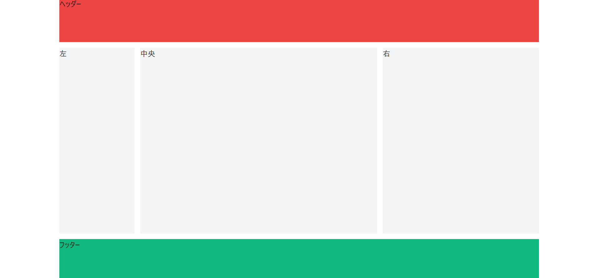
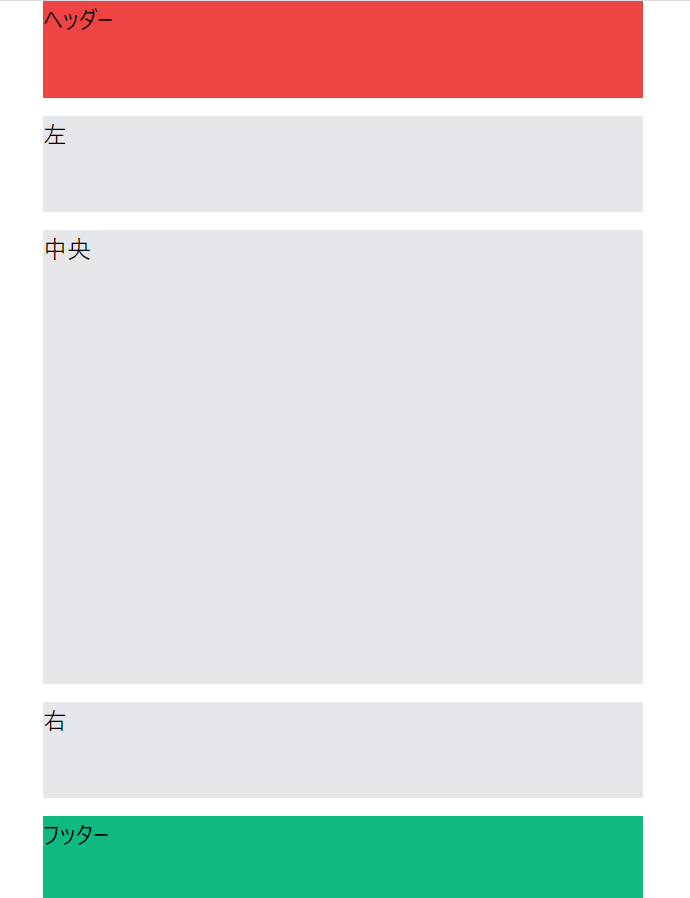

import { Link } from 'gatsby'

どうもカニヤです。

最近**Tailwindcss の勉強**をしているので、<br/>
その一環として**テンプレートな Web サイトをデザインしたい**と思いました。

そのため、今回は**Tailwind での Grid システムの使い方**も学びながら、
**杯型の Web サイト**をデザインします。

ということで、**TailwindCSS で Grid システムを使った、**
**テンプレートな Web サイトをデザインする方法**を紹介していきます。

### インストール

---

<br />

今回はおそらく**一緒に使うことが多い Nextjs**を使ってデザインしていきます。

**Nextjs と TailwindCSS**のインストール方法は**こちらの記事**で解説。↓

記事：<Link to="/posts/nextjs" className="linkcolor link-text">【入門】nextjs + tailwindcss の始め方</Link>

### セットアップ

---

<br />

**サイトの完成形**はこんな感じです。↓


今からこのデザインになるように**コーディング**していきます。

はじめに**下準備**をします。

**index.js**を開き、下記のようにコードを書き換えます。

```jsx
import Head from 'next/head'

export default function Home() {
  return (
    <div>
      <Head>
        <title>Create Next App</title>
        <meta name="description" content="Generated by create next app" />
        <link rel="icon" href="/favicon.ico" />
      </Head>

      <header>ヘッダー</header>

      <nav>左</nav>
      <main>中央</main>
      <aside>右</aside>

      <footer>フッター</footer>
    </div>
  )
}
```

これで下準備は完了です。

コーディングを開始する前に**TailwindCSS の書き方**が分かる、<br/>
**チートシートサイト**の URL を貼っときます。

サイト URL：<Link to="https://nerdcave.com/tailwind-cheat-sheet" className="linkcolor link-text"> tailwindcss チートシート</Link>

### コーディング

---

<br />

最初は**全体を囲っている div タグ**から CSS を当てます。

```jsx
<div className="w-4/5 min-h-screen mx-auto -my-0 ">

```

**画面と同じ大きさにしたい**ので**min-h-screen**を当てる。

**左右を少し開ける**ために、横幅を**w-4/5**にして<br/>
上下のマージンを-my-0、左右を mx-auto。

これにより大体**min-height: 100vh,width: 800px,margin: 0 auto**を当てた感じになります。

次に**横の Grid**から当てていきます。

```jsx
<div
className="w-4/5 min-h-screen mx-auto -my-0
grid grid-cols-1 sm:grid-cols-6 gap-3"
>

```

**grid**と書くだけで**Grid システムを使うこと**ができます。

**Grid 間に空白を入れたい**ので **gap-3**を当て 12px 空くようにする。

<blockquote display="warning">

ここで**注意したい**のが、sm:grid-cols-6 が**デバイスの横幅が 640px 以上**に適応されて、

grid-cols-1 が**横幅が 640px 以下**に適応されるという事です。

私は**逆だと思っていた**ので、**注意ポイント**として書きました。

</blockquote>

次に**縦の Grid**を当てます。

```jsx
<div　
className="w-4/5 min-h-screen mx-auto -my-0
grid grid-cols-1 grid-rows-8 sm:grid-cols-6 gap-3"
>
```

**grid-rows-8**を設定することで**縦を８分割**する。

これで**div タグの CSS**は完了です。

次から**ヘッダーなどに CSS**を当てます。

```jsx
<header className="bg-red-500 col-span-6　row-span-1">ヘッダー</header>

<nav
className="row-span-1 col-span-6 sm:col-span-1 sm:row-span-6 bg-gray-200"
>左</nav>

<main
className="row-span-6 col-span-6 sm:col-span-3 sm:row-span-6 bg-gray-200"
>中央</main>

<aside
className="row-span-1 col-span-6 sm:col-span-2 sm:row-span-6 bg-gray-200"
>右</aside>

<footer className="bg-green-500 col-span-6　row-span-1">フッター</footer>
```

**背景色がない**と分かりずらいので、<br/>
**ヘッダーに赤・フッターに緑・真ん中にグレー**を付けます。

ヘッダーとフッターは**横いっぱいにしたい**ので**col-span-6**を当てます。

左を**サイドバー**、中央を**コンテンツ**、右を**広告**と言った感じにしたいので、
nav を**sm:col-span-1**、main を**sm:col-span-3**、aside を**sm:col-span-2**にする。

**640px 以上**の時は,**nav,main,aside**は縦幅を広く取りたいので、**sm:row-span-6**とする。

そして、横幅が**640px 以下**になったら**全部縦一列に並ぶように col-span-6**にして、
**main だけ**縦幅を広くするために**row-span-6**、**それ例外を row-span-1**にする。

実際に**画面を小さく**して、こんな感じになったら**完成**です！



### まとめ

---

<br />

今回**TailwindCSS で Grid システムを使った**、<br/>
**テンプレートな Web サイトのデザイン方法**を解説しました。

TailwindCSS で Grid システムを使うのは**まだ慣れません**が、<br/>
これからさらに**理解を深めてスラスラ書けるようになりたい**と思います。

これからも**TailwindCSS の記事を書こう**と思うので、<br/>
**興味がある人**はまた見に来てください。

最後まで読んでくださりありがとうございます。

関連記事：<Link to="/posts/tailwind" className="linkcolor link-text">【入門】tailwindcss の使い方</Link>

---
