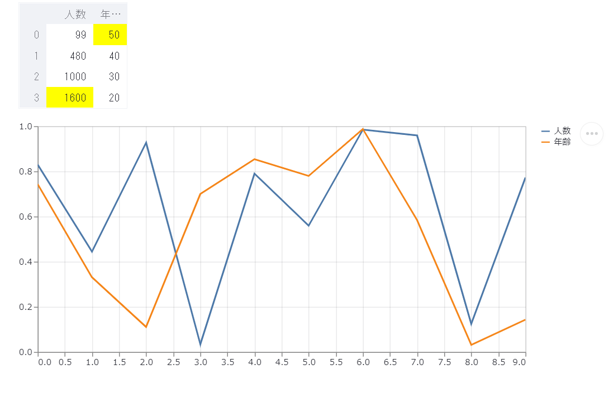
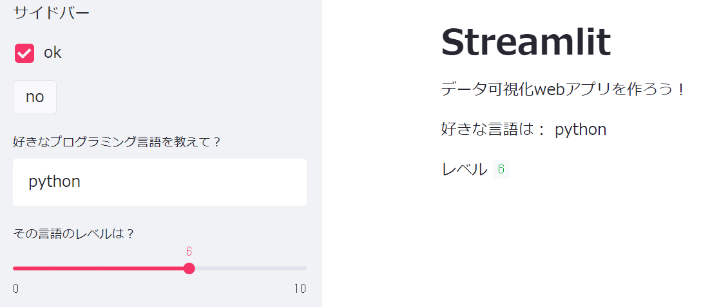

import { Link } from 'gatsby'

### streamlit とは

---

<br />

**streamlit** はフロントエンドのコードを書くことなく、<br/>
**web アプリ**を作成できる python の**フレームワーク**。

また、データを簡単に**グラフ**や**表**にして可視化することができる。

### インストール

---

<br />

`pip install streamlit`

### streamlit 使い方

---

<br />

#### タイトルと文章の表示

```python
import streamlit as st

st.title('Streamlit')
st.write('データ可視化webアプリを作ろう！')

'''
# Streamlit
データ可視化webアプリを作ろう！
'''
```

ターミナルで以下のように実行。

`streamlit run ファイル名.py`

実行して開くと、**タイトルと文章**が表示される。<br/>
**md 記法**でも同じように書くことができます。

#### 表とグラフ表示

---

<br />

```python
import streamlit as st
import pandas as pd

url = "取得したいデータがあるサイトのUrl"
data = pd.read_html(url)[インデックス番号]

st.dataframe(data.style.highlight_max())
st.line_chart(data)
```



このようにデータを渡すだけで、<br/>
簡単に**表とグラフ**を表示することができます。

また **style.highlight_max()**とすることで、<br/>
表の**最大値**にハイライトを付けられる。

<Link to="/posts/scraping" className="linkcolor link-text">
  Beautifulsoup・Seleniumなしでスクレイピングする方法
</Link>

**read_html**の使い方は、↑ こちらで解説しています。

#### インタラクティブ表示

---

<br />

```python
st.sidebar.write("サイドバー")
if st.sidebar.checkbox("ok")
    st.sidebar.button("no")

output = st.sidebar.text_input('好きなプログラミング言語を教えて？')
'好きな言語は：',　output

level = st.sidebar.slider('その言語のレベルは？',0　,10　,5)
'レベル',　level
```



**普通**に表示する場合は、.checkbox・button で表示。<br/>
**サイドバー**に表示する場合は、.sidebar.〇〇で表示する。

さらに、**if 文**を組み合わせ checkbox を押すことで、<br/>
button を**表示、非表示**にできる。

text_input は(タイトル)、<br/>
slider は(タイトル,最小値,最大値,初期値)で表示します。

そして、入力を**変数**に代入することで、<br/>
**インタラクティブ**に表示を変えられる。

### まとめ

---

<br />

これだけでも簡易的ではありますが、<br/>
**web アプリ**を作成することができます。

今回は**データの可視化**に重点を置いたので、<br/>
全部を紹介することはできませんでした。

**streamlit**には他にも多くの機能があります。<br/>
他の機能が気になる方は**公式ドキュメント**を見ることをオススメします。

<span className="line line-yellow">\Streamlit の Udemy おすすめ講座/</span>
<br />
<br />


<a
  href="https://px.a8.net/svt/ejp?a8mat=3HIGXH+87WGFM+3L4M+BW8O2&a8ejpredirect=https%3A%2F%2Fwww.udemy.com%2Fcourse%2Fpython-streamlit%2F"
  rel="nofollow"
>
  爆速で5つのPython Webアプリを開発
</a>

