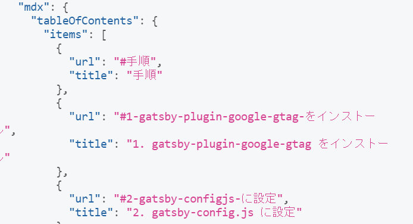

今回は gatsby ブログで、<br/>
**MDX**で記事を書いている人向けに<br/>
**目次の付け方**を紹介します。

### はじめに

---

<br />

最初に記事表示ページの<br/>
**graphql**に**tableOfContents**を追加します。

```js
mdx {
    tableOfContents
}
```

**tableOfContents**は MDX で目次を作るのに<br/>
**必要なもの**です。

### 目次コンポーネントの作成

---

<br />

```tsx
import React from 'react'
import { Link } from 'gatsby'

type Props = {
  items: any
}
const Toc: React.FC<Props> = props => {
  return (
    <div>
      <ul>
        {props.items.map(item => (
          <li key={item.url}>
            <Link to={item.url}>{item.title}</Link>
            {item.items && <Toc items={item.items} />}
          </li>
        ))}
      </ul>
    </div>
  )
}

export default Toc
```

**tableOfContents の中身**が



↑ このようになっているので、<br/>
要素を１つ１つ取り出すために<br/>
**map 関数**を使います。

そして、**記事表示ページ**に
目次コンポーネントを追加します。

```tsx
<Toc items={data.mdx.tableOfContents.items} />
```

### プラグインを導入

---

<br />

**見出しに id を自動**で付けてくれる<br/>
プラグインをインストールします。

**npm install gatsby-remark-autolink-headers**

gatsby-config.js に設定を追加します。

```js
{
  resolve: `gatsby-plugin-mdx`, // マル
    options: {
      gatsbyRemarkPlugins: [
        `gatsby-remark-autolink-headers`,
      ],
    },
}
```

<span className="line line-yellow">
  ここで注意したいのは、↓下記のように書くこと。
</span>
<br />
<br />

```js
resolve: 'gatsby-transformer-remark', // バツ
options: {
  plugins: [
    `gatsby-remark-autolink-headers`,
  ]
}
```

最初このように書いて、<br/>
動かず、**時間を無駄**にしました。

なので、**気を付けてください！**

### まとめ

---

<br />

これで目次を**クリック**すると、<br/>
飛ぶようになります。

あとは**CSS**を当て、<br/>
好みの見た目にすれば**完成**です。

以上、**Gatsby ブログで MDX 記事の目次の付け方**を紹介しました。

記事に**目次がある方**が<br/>
**ユーザービリティ**が高いので、

**個人ブログ**をやり始めた人は、<br/>
基本的に**目次はあった方**が良いと思います。

こんな感じで、これからも**Gatsby の記事**を<br/>
ボチボチ**投稿**します。

---
