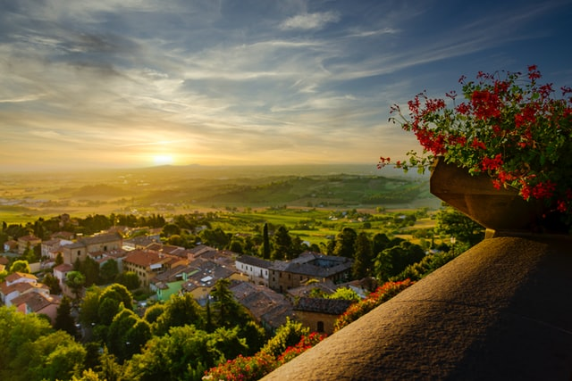
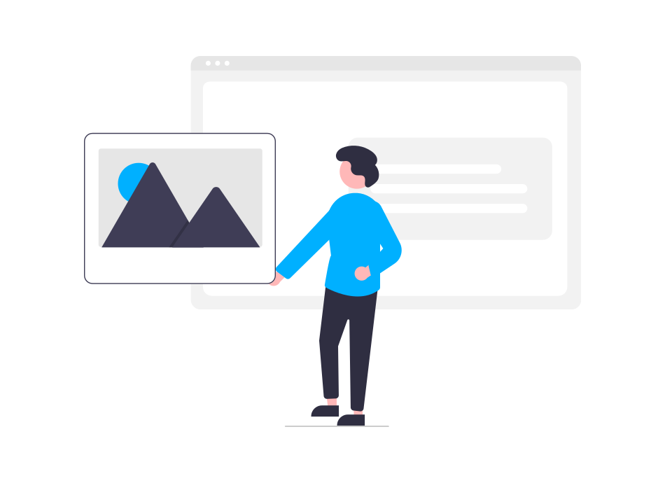
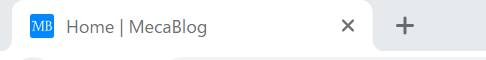

import { Link } from 'gatsby'

どうもカニヤです。

  ブログを始めたばかりで、
   
  画像・イラスト・アイコン素材などをどうやって
   
  集めればいいか分からない。

と悩んだことありませんか？

私もついこの前まで**同じような悩み**を抱えてました。

なので、色々調べた結果。

非常に便利なサイトを見つけ、 
今では**素材集めに困ること**は無くなりました。

**多くを紹介しても**どれを使えばいいか迷ってしまうので、

今回は**個人的におすすめできるピックアップした 3 選**を紹介したいと思います。

絞ったので、**簡単に読める記事**になっています。

この記事を読み終えたら**あなたの悩みは解消される**と思います。

### 1. unsplash

---

 

はじめに紹介するのは**unsplash**です。

**unsplash のおすすめポイント**

<blockquote display="info">

- オシャレな画像
- 高画質
- 画像が大量
- 無料

</blockquote>

こんな感じの**オシャレな画像が全て無料。**

**様々なジャンルの画像がある**ので、 
どんな記事を書く時にも役立つ。

実際サムネイル画像に良く使わせてもらってます。

**unsplash**がすごいのは**これだけではなく,** 
画像を**ダウンロードしなくても使える点**。

**unsplash source**を使うと＜ img ＞タグの src に画像の url を渡すだけで、 
**画像を表示**できます。

`https://source.unsplash.com/random`

とすると画像を**ランダム**に表示することもできます。

<Link to="https://unsplash.com/" className="linkcolor link-text">
  https://unsplash.com/
</Link>
 
 

ただ海外のサービスで**全部英語**です。 
なので、**検索する時は英語で入力する必要**があります。

**日本語入力**じゃないとヤダと言う人は、

<Link to="https://o-dan.net/ja/" className="linkcolor link-text">
  https://o-dan.net/ja/
</Link>
 
 

この**o-dan もオシャレな画像を無料で使えるサイト**なので、
使ってみることを**おすすめ**します。

### 2. undraw

---

 

次に紹介するのは**undraw**です。

**undraw のおすすめポイント**

<blockquote display="info">

- オシャレなイラスト
- イラスト数が多い
- テーマカラーを変えられる
- 無料

</blockquote>

↑ 今回の記事のサムネに使っている画像

イラストと言えば「いらすとや」が有名。

しかし、あれだと他のブログと**被ること**が多いので、

上記のイラストのように**オシャレなもの**が多い**undraw**を選びました。

undraw の良い点は**テーマカラー**を 
好きに**カスタマイズできる点**です。

色を選べるおかげで、 
ブログや記事ごとの**色の調和**を取ることができます。

<Link to="https://undraw.co/illustrations" className="linkcolor link-text">
  https://undraw.co/illustrations
</Link>
 
 

### 3. favicon.io

---

 

最後に紹介するのは**favicon.io**です。

**favicon.io のおすすめポイント**

<blockquote display="info">

- 画像・テキスト・絵文字の３つから作成できる
- 色・大きさ・フォントをカスタマイズできる
- 無料

</blockquote>

これを使うことで**無料**で、 
自分だけの**オリジナルアイコン**を作成することができます。

↑ ちなみに**MecaBlog のアイコン**はこんな感じです。

favicon.io に関しては**こちらの記事**で 
詳しく解説しています。

<Link to="/posts/favicon" className="linkcolor link-text">
  ブログのアイコンを無料で作る方法[Gatsbyjs]
</Link>
 
 

### まとめ

---

 

今回は**おすすめ無料で使える素材サイト 3 選**を紹介しました。

<blockquote display="info">

- unsplash
- undraw
- favicon.io

</blockquote>

この**3 つ**を使えば、 
ブログの素材集めに**困ることはなくなる**と思います。

これらを使って**記事を彩り**、 
一緒に**ブログライフ**を楽しみましょう。

---
