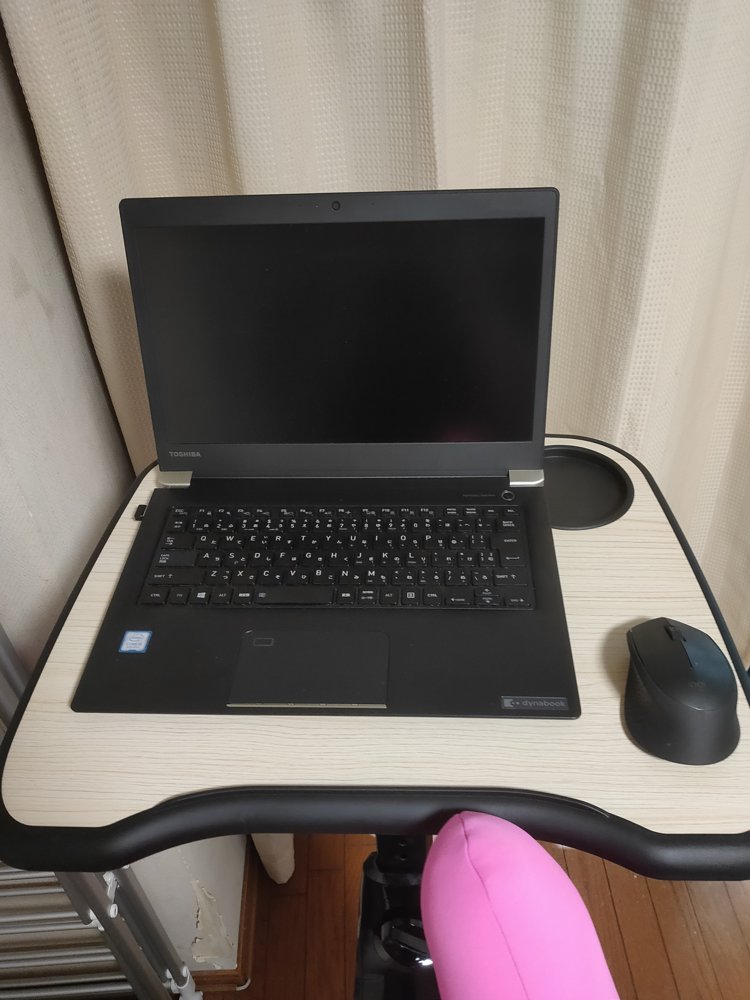
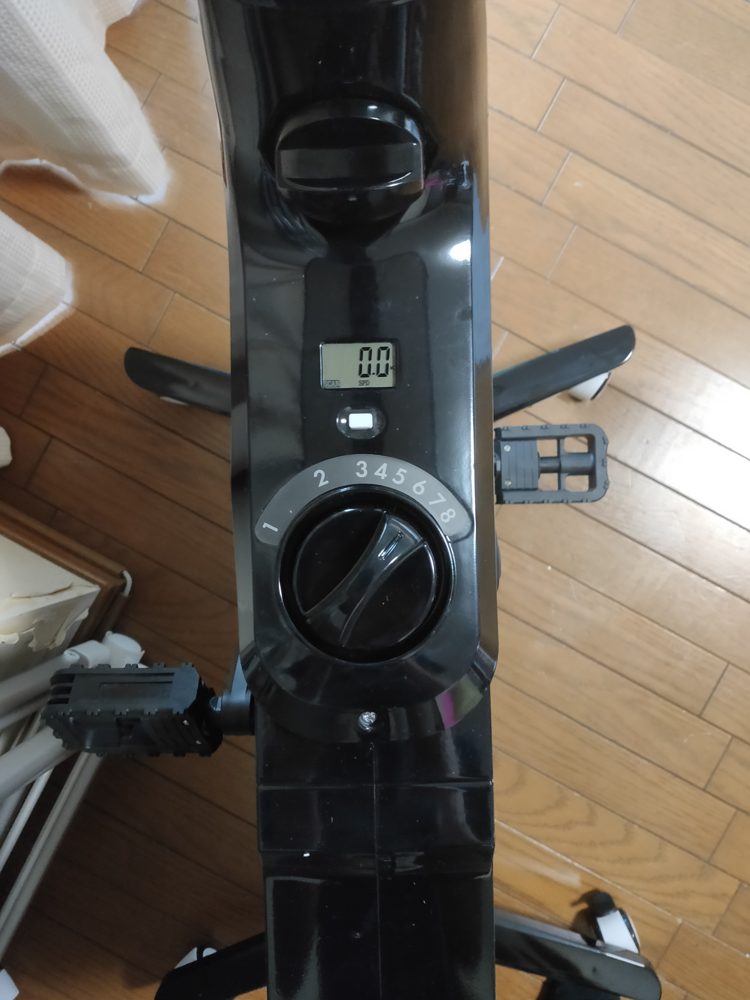

どうもカニヤです。

突然ですが最近**在宅ワークなど**で、 
**運動不足**に悩んでいませんか？

わたしは最近ずっと家にいることや 
**座って作業**していることが多く、 
**運動不足**に悩んでいました。

そのため、作業をしながら運動ができる 
**便利なもの**を探していました。

しかし、**そんな都合の良いもの**はなかなか見つかりません。

そんな中、**諦めかけてた**わたしは遂に

このツクエアロ２を見つけました。
 
 

見た瞬間**わたしが求めてたものはこれだ！** 
と思い購入ボタンをクリックしました。

そして、実際に使ってみて改めて 
**購入して良かった**と思ったので、 

今回はそんな**ツクエアロ２**を 
**使ってみた感想**を書きたいと思います。

### ツクエアロ２とは

---

 

**ツクエアロ２**について簡単に説明したいと思う。

<blockquote display="info">

- 名称：ツクエアロ２
- ブランド：Qurra
- 値段：29,900 円（税込み）
- 本体重量：約 23kg
- カラー：ブラック
- 機能：仕事をしながら運動不足を解消できるデスクが付いたエアロバイク

</blockquote>

組み立ても**簡単**で 
こういう事をあまりやらない私でも、 
**5 分ぐらいで組み立てること**ができた。

**裸足でペダルを漕ぐと少し痛い**ので、 
**靴下かスリッパ**を履くことを勧めます。

\6 か月間の保証付き/

<a
  href="//af.moshimo.com/af/c/click?a_id=2751507&amp;p_id=54&amp;pc_id=54&amp;pl_id=616&amp;url=https%3A%2F%2Fitem.rakuten.co.jp%2Fmikawa3r%2F3r-abk02%2F&amp;m=http%3A%2F%2Fm.rakuten.co.jp%2Fmikawa3r%2Fi%2F10012152%2F"
  rel="nofollow"
  referrerpolicy="no-referrer-when-downgrade"
>
  Qurra ツクエアロ 2 デスク付き バイク フィットネス バイク テーブル フィットネス
  静音 高さ調整 マグネットブレーキ キャスター 在宅ワーク 運動 折りたたみ 高齢者
  ペダル 家庭用 コンパクト ミニ 連続使用時間 連続使用 60 分 電源不要
  スピンバイク
</a>

 
 

### 良かった点

---

 

実際に使ってみて良かった点

<blockquote display="info">

1. ながら運動ができる
2. 見た目が浮いていない
3. 負荷を 8 段階で調整できる
4. 移動が簡単

</blockquote>

  １番の魅力ポイントは、ながら運動ができる点

です。
 
 

実際この記事を書いている今も 
**ながら運動**してます。（笑）

**パソコン**作業だけでなく、**スマホ**をいじっている時や**映画**を見てる時など 
気づいたら**基本乗ってる**ので、**結構いい運動**になります。

使い始めた二日目はいきなり足が筋肉痛。

どんだけ**運動不足だったのか**と分かると同時に 
**何気なく乗ってる**だけでも結構**効果ある**なと思いました。

そんなこんなで、**ツクエアロ２の特徴**の**ながら運動**のおかげで 
**本来の目的**である**運動不足**を解消できたのが、個人的に**1 番良かった点**です。

**2 つ目**のポイントは、 

見た目が浮いていない点です。
 
 

**シンプルなブラックカラー**なので、 
主張が激しくなく、**部屋の雰囲気を壊さない点**が個人的に良かったです。

**3 つ目**のポイントは、 

負荷を 8 段階調整できる点です。
 
 

ギアが**8 段階**なので、自分のその時の**状態**に合わせて、 
**細かく負荷**を変えられるのが良いと思いました。

**４つ目**のポイントは、 

移動が簡単な点です。
 
 

**キャスター**が付いているので、 
その日の気分で**好きな場所**に移動したい時など

いつでも**簡単に移動**させられるのが、 
個人的にポイントが高いです。

また、**ロック機能**が付いているので、 
勝手に動いたりせず**安心**して使えます。

### 良くなかった点

---

 

実際に使ってみて良くなかった点

<blockquote display="info">

1. デスクとイスの調整がやりずらい
2. イスが少しガタつく

</blockquote>

**1 つ目**のポイントは、

デスクやイスの調整が少しやりずらい点
です。
 
 

**ネジを閉めて固定する形式**なので、 
商品によって変わると思いますが、 
**上手くネジが回らない場合**があります。

そのため、高さを**すぐに調整できず** 
**手間取る時がある**のが、少し残念でした。

**2 つ目**のポイントは、 

  イスのネジをしっかり閉めても少しガタついてしまう点

です。
 
 

こちらも商品によって変わると思いますが、 
前後に動くと**ちょっとガタつく**ので、**長時間**座るとお尻が少し痛くなります。

とは言っても**この２つ**ぐらいしか、 
**良くなかった点**はありませんでした。

### まとめ

---

 

色々語りましたが、 
やっぱり何といっても**一番の魅力**は 
**ながら運動**ができることです。

非常に**満足**しているので、 
改めて**購入して良かった**と思ってます。

同じように**運動不足に悩んでいる人**や 
パソコン作業をしながら**運動したい人**は、 
**一度**商品を見てみるのが良いと思います 。

そうすれば、**ツクエアロ２の魅力**が 
分かると思います。

また、わたしが購入した時は一日後に在庫切れになっていたので、 
**購入**を検討している人は**お早めに**!

詳しくはこちら ↓

<a
  href="//af.moshimo.com/af/c/click?a_id=2751507&amp;p_id=54&amp;pc_id=54&amp;pl_id=616&amp;url=https%3A%2F%2Fitem.rakuten.co.jp%2Fmikawa3r%2F3r-abk02%2F&amp;m=http%3A%2F%2Fm.rakuten.co.jp%2Fmikawa3r%2Fi%2F10012152%2F"
  rel="nofollow"
  referrerpolicy="no-referrer-when-downgrade"
>
  Qurra ツクエアロ 2 デスク付き バイク フィットネス バイク テーブル フィットネス
  静音 高さ調整 マグネットブレーキ キャスター 在宅ワーク 運動 折りたたみ 高齢者
  ペダル 家庭用 コンパクト ミニ 連続使用時間 連続使用 60 分 電源不要
  スピンバイク
</a>

 
 

---
