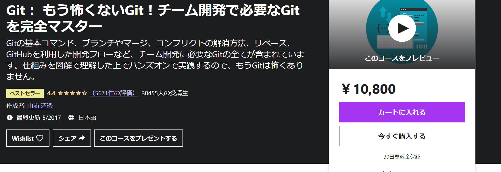

import { Link } from 'gatsby'

  Udemyって色々講座がありすぎて、どれを買えばよいか分からない。

 

  セールとかやってるけど、購入するタイミングっていつが良いの？

と**悩んでいる方多い**と思います。

今回**20 以上の講座を受講した私**がそういう方の悩みを解決すべく記事を書きました。

実際わたしもはじめは、**どの講座が良いのか分からず**色々な講座を受講しました。

**受講した中**には「購入して損した…」という講座もありました。

しかし、「購入して良かった」講座も多数あったのでこの記事では, 
**その中からピックアップした Udemy のおすすめ講座を５つ紹介！** 
また、**一緒におすすめの買い方**も紹介します。

この記事を読み終えた頃には、 
もう**あなたは Udemy 講座の選択に迷うこと**はなくなっているでしょう。

### おすすめ講座 5 選

---

 

1. **Git：もう怖くない Git！チーム開発で必要な Git を完全マスター**

【プログラミング】 
おすすめ講座**1 つ目**はGit：もう怖くない Git！チーム開発で必要な Git を完全マスターです。

**\こういう人におすすめ/**

<blockquote display="info">

- git 初心者
- git のチーム開発をしたことない人
- git を復習したい人

</blockquote>

**git**はエンジニアを目指すなら**必須のスキル**なので、必ず覚えたいものです。

この講座では**Git の基礎から Git でのチーム開発のやり方**まで学べます。

また、**大変丁寧**に教えてくださるので、初心者の私も**つまずくことなく学ぶこと**ができました。

git の講座は**他にも沢山**ありますが、 
**基礎から応用まで網羅的にできる講座**はおそらくこの講座だけだと思います。

 

  <a
    href="https://px.a8.net/svt/ejp?a8mat=3HIGXH+87WGFM+3L4M+BW8O2&a8ejpredirect=https%3A%2F%2Fwww.udemy.com%2Fcourse%2Funscared_git%2F"
    rel="nofollow"
  >
    Udemy公式サイトで見る
  </a>
  

 
 

2. **フロントエンドエンジニアのための React ・ Redux アプリケーション開発入門**

---

 

【プログラミング】 
おすすめ講座**2 つ目**はフロントエンドエンジニアのための React ・ Redux アプリケーション開発入門です。

**\こういう人におすすめ/**

<blockquote display="info">

- JavaScript の基礎が終わった人
- react を復習したい人
- フロントエンドエンジニアになりたい人

</blockquote>

**React**は **Facebook 社**が開発した**JavaScript ライブラリ**です。

現在 React は **Facebook、Instagram**。また、**Yahoo!・Netflix・Uber など世界中のサービス**に使われていて、
今**勢いのあるライブラリ**と言えます。

そのため、**フロントエンドエンジニアを目指している方**は必ずと言っていいほど 
**React を使うことになる**と思うので、学んでおいた方がいいと思います。

この講座は私がやった React の講座の中で**一番丁寧で分かりやすく入門にピッタリの講座**なので紹介しました。

また、講師の**はむさん**は、他にも**React の講座を多数**出しているので、 
他の講座も一緒に受講すれば、**React の基礎から応用まで幅広く学ぶこと**ができます。

 

  <a
    href="https://px.a8.net/svt/ejp?a8mat=3HIGXH+87WGFM+3L4M+BW8O2&a8ejpredirect=https%3A%2F%2Fwww.udemy.com%2Fcourse%2Freact-application-development%2F"
    rel="nofollow"
  >
    Udemy公式サイトで見る
  </a>
  

 
 

3. **プログラミングを業務で活かす！Python による Web API 活用講座**

---

 

【プログラミング】 
おすすめ講座**3 つ目**はプログラミングを業務で活かす！Python による Web API 活用講座です。

**\こういう人におすすめ/**

<blockquote display="info">

- web-api の知識が欲しい人
- Python の基礎が終わった人
- 業務での活かし方を知りたい人

</blockquote>

私は Python が好きなこともあり**Python の講座を多く受講している**のですが、 
**Python の講座の中でも**この講座はおすすめです。

  Pythonを学んだは良いが、データ分析以外での業務への活かし方が分からない。

こういう人は多いんじゃないでしょうか。 
実際わたしもそうでした。

しかし、**そんな悩みをこの講座が解決してくれました。**

この講座は**Python の業務への活かし方を学べる**だけでなく、 
**Web API の使い方**も一緒に学ぶことができるので、**一石二鳥**です。

講師の**今西航平さん**は他にも**多数の Python の講座**を出していて、 
そちらも**素晴らしい**ので受講してみてください。

 

  <a
    href="https://px.a8.net/svt/ejp?a8mat=3HIGXH+87WGFM+3L4M+BW8O2&a8ejpredirect=https%3A%2F%2Fwww.udemy.com%2Fcourse%2Fpython-web-api%2F"
    rel="nofollow"
  >
    Udemy公式サイトで見る
  </a>
  

 
 

4. **【JavaScript＆CSS】ガチで学びたい人のための WEB 開発徹底実践（フロントエンド編）**

---

 

【デザイン】 
おすすめ講座**4 つ目**は【JavaScript＆CSS】ガチで学びたい人のための WEB 開発徹底実践（フロントエンド編）です。

**\こういう人におすすめ/**

<blockquote display="info">

- Web デザイナーを目指している人
- Sass を知りたい人
- 実践的な CSS を学びたい人

</blockquote>

この講座はプログラミングをするのですが、 
**デザイン寄りなので、デザインのカテゴリー**で紹介します。

Udemy には**HTML＆CSS の入門の講座は多い**のですが、
**HTML＆CSS の中級以上の講座はほとんどありません。**

そのほとんどない HTML＆CSS の中級以上の講座が**この講座**。

  俺はWebデザイナーになるから、もっとCSSを深く知りたいんだ。

と言う人に**この講座はピッタリ**です。

私も**もう少し深く CSS を知りたい**と軽い感じで**この講座を受講。**

そしたら、「オレ全く CSS 使えてなかったんだ」と現実を突きつけられました。

講座のタイトルにもある通り、**かなりガチで学びたい人向けの内容**です。

そのため、**Web デザイナーを目指している人**には受講することを**強く勧めます。**

 

  <a
    href="https://px.a8.net/svt/ejp?a8mat=3HIGXH+87WGFM+3L4M+BW8O2&a8ejpredirect=https%3A%2F%2Fwww.udemy.com%2Fcourse%2Ffront-dev-tutorial%2F"
    rel="nofollow"
  >
    Udemy公式サイトで見る
  </a>
  

 
 

5. **初心者から始めるアプリデザイン＜ UI/UX デザインを Figma で学ぼう！＞ Web デザインにも応用可能**

---

 

【デザイン】 
おすすめ講座**5 つ目**は初心者から始めるアプリデザイン＜ UI/UX デザインを Figma で学ぼう！＞ Web デザインにも応用可能です。

**\こういう人におすすめ/**

<blockquote display="info">

- Web デザイナーを目指している人
- アプリ開発をしている人
- UI/UX デザインを学びたい人

</blockquote>

いよいよ最後の紹介となります。

  Figmaってアクションフィギュアのfigmaのこと？

と知らない人もいると思うので説明します。

Figma は**ブラウザ上で Web・アプリデザインを簡単にできるツール**です。 
さらに、Figma は**無料のプラン**があるので気軽に使うことができます。

この講座では**今流行の Figma を１から学ぶこと**ができます。

また、**UI/UX デザインのコツ**を学べるので、 
今後自分が**何かしらデザインする時の着目点**が分かるようになります。

 

  <a
    href="https://px.a8.net/svt/ejp?a8mat=3HIGXH+87WGFM+3L4M+BW8O2&a8ejpredirect=https%3A%2F%2Fwww.udemy.com%2Fcourse%2Ffigma-app-design%2F"
    rel="nofollow"
  >
    Udemy公式サイトで見る
  </a>
  

 
 

### おすすめの買い方

---

 

今回は**私の経験上一番良い講座の買い方**を紹介します。

<blockquote display="info">

- 一度に買いすぎない
- クーポンで購入

</blockquote>

まず**一度に買いすぎない**から解説。

Udemy は**セールをすると講座が約７割引き**になります。
（セールによって割引額は違う！）

1 講座が**大体 1000 ～ 3000 円**になり大変安いので、 
ついつい**一度に多くの講座**を買ってしまいます。

しかし、これは止めた方が良いです。

講座の中には**似た内容のもの**があります。 
例：公式ドキュメントのチュートリアルを日本語訳しただけのもの

（私も似た内容の講座を複数購入した経験あり）

なので、購入する時は**同じ言語の講座は２つぐらいにした方**が無駄に購入せずに済みます。

受講してみて、それでも**物足りなかったら**その時また購入すれば良い。

Udemy は**セールを何度も行う**ので、前のセールで買った講座が**終わったタイミング**で 
**新しいセールが始まること**はよくあります。

これらの理由から、**一度に買いすぎるのは止めましょう。**

 

次に**クーポンで購入**を解説します。

正直この内容が一番重要です。
 
 

このクーポンとは**Udemy 講師の方が発行するクーポン**です。

このクーポンを使えば講座が**約 9 割引き**で購入することができます。 
つまり、**セールで購入するより安い。**

なので、クーポンを**使わない手はありません。**

**クーポンの入手方法**

<blockquote display="default">

- Twitter
- YouTube

</blockquote>

講師の方の**Twitter や YouTube で入手できます。** 
（**注意！**全ての講師の方がクーポンを発行しているわけではありません）

クーポンは**期限や枚数制限がある**ので、 
**速めに貰い**に行きましょう！

ということで、クーポンがない時以外は**基本クーポンで購入するのが良い**と思います。

### まとめ

---

 

今回**Udemy のおすすめの講座 5 選と買い方**を紹介しました。

<blockquote display="info">

1. Git：もう怖くない Git！チーム開発で必要な Git を完全マスター【プログラミング】
2. フロントエンドエンジニアのための React ・ Redux アプリケーション開発入門【プログラミング】
3. プログラミングを業務で活かす！Python による Web API 活用講座【プログラミング】
4. 【JavaScript＆CSS】ガチで学びたい人のための WEB 開発徹底実践（フロントエンド編）【デザイン】
5. 初心者から始めるアプリデザイン＜ UI/UX デザインを Figma で学ぼう！＞ Web デザインにも応用可能【デザイン】

</blockquote>
 
 

  <a
    href="https://px.a8.net/svt/ejp?a8mat=3HIGXH+87WGFM+3L4M+6LP3M"
    rel="nofollow"
  >
    Udemy公式サイトで見る
  </a>
  

 
 

どの講座も**本当におすすめ**なのでぜひ受講して、 
**新しい知識やスキル**を一緒に身に付けていきましょう！

今回**紹介しなかった**ですが、<bt/>
Udemy には**まだまだ多数の素晴らしい講座がある**ので、 
**自分に合った講座**を見つけてみてください。

**ゲーム開発に興味がある人**は**こちらの記事**も良ければ読んでみてください。 

関連記事：<Link to="/posts/game" className="linkcolor link-text">ゲームプログラミングのおすすめ言語＆ゲームエンジン&勉強法</Link>

この記事では**ゲームプログラミングのおすすめ Udemy 講座**を紹介しています。

---
